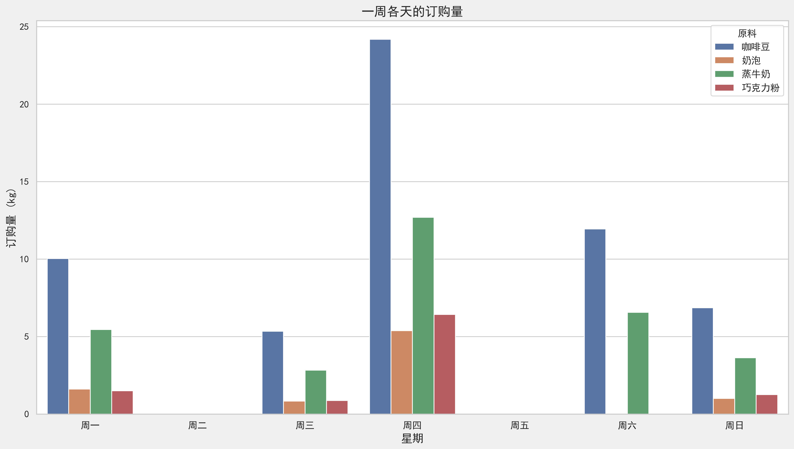
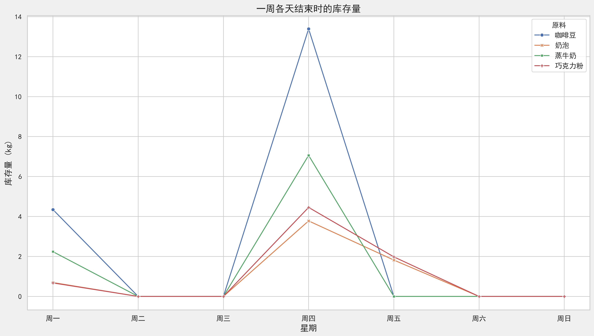
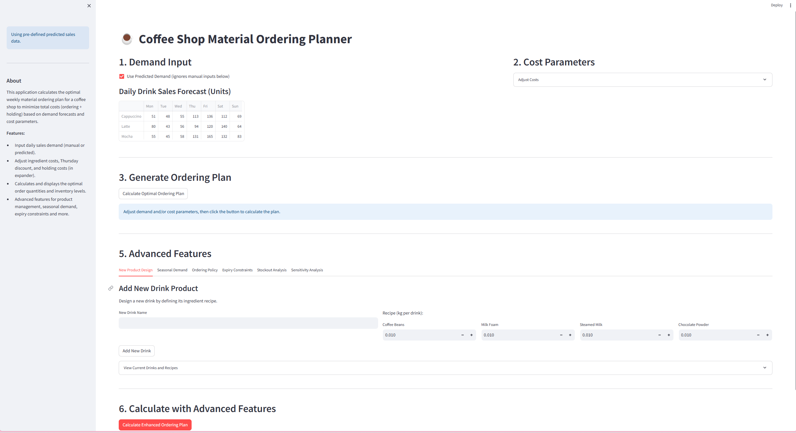
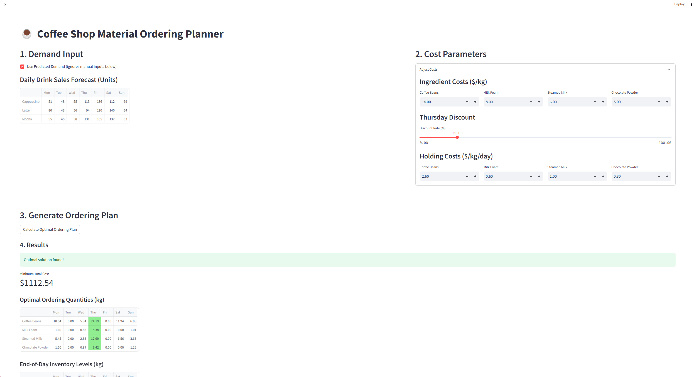
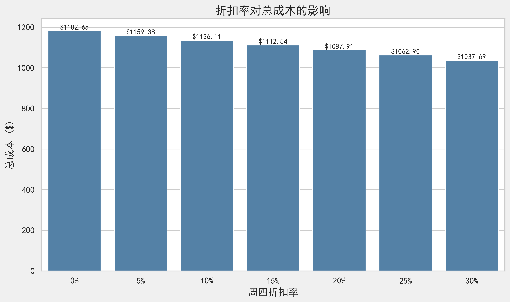
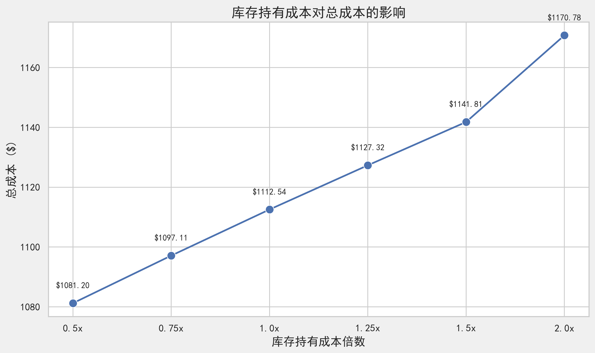
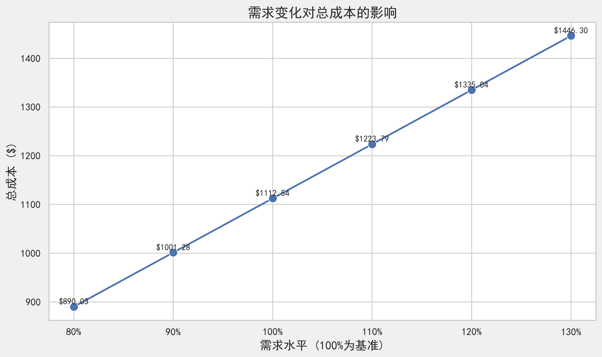

# Amazing Coffee 咖啡库存规划系统 - 项目总结

## 1. 项目概述

Amazing Coffee计划在香港开设一家新店铺，销售三款最受欢迎的饮品：卡布奇诺、拿铁和摩卡。为了确保店内有足够的原材料满足销售需求，同时控制成本，公司需要一个智能的库存规划系统。本项目旨在开发一个基于数据驱动的库存规划系统，通过预测未来一周的咖啡饮品需求，制定最优的原材料订购计划，以最小化总成本（包括原材料成本和库存持有成本）。

### 1.1 业务背景

- **店铺情况**：Amazing Coffee在香港的新店铺
- **产品组合**：三款主打饮品（卡布奇诺、拿铁、摩卡）
- **业务挑战**：
  - 确保原材料供应充足，避免缺货
  - 控制库存成本，避免过度库存
  - 利用供应商折扣，优化采购时机

### 1.2 饮品配方与原材料

**饮品配方**：

| 饮品 | 咖啡豆 | 奶泡 | 蒸牛奶 | 巧克力粉 |
|------|--------|------|--------|----------|
| 卡布奇诺 | 40g | 10g | 10g | - |
| 拿铁 | 25g | 5g | 20g | - |
| 摩卡 | 30g | - | 20g | 15g |

**原材料成本**：

| 原材料 | 咖啡豆 | 奶泡 | 蒸牛奶 | 巧克力粉 |
|--------|--------|--------|--------|--------|
| 每千克成本（周四除外） | $14 | $8 | $6 | $5 |
| 每千克成本（周四折扣价） | $11.9 | $6.8 | $5.1 | $4.25 |
| 库存持有成本（每天每千克） | $2.6 | $0.6 | $1 | $0.3 |

### 1.3 业务约束条件

- 周二和周五无法订购任何原材料
- 周四原材料有15%折扣
- 周一之前不存有任何库存
- 需要满足每日预测的饮品需求

## 2. 数据驱动的需求预测（方案：任务1）

### 2.1 预测方法概述

本项目采用数据驱动的机器学习方法，分析历史需求数据，预测未来一周（第16至22天）的饮品需求。数据驱动的预测方法优势在于：

- **客观性**：基于实际历史数据，减少主观判断偏差
- **模式识别**：自动识别周期性模式和需求趋势
- **可重复性**：使用标准算法，确保结果可重复且可解释
- **多因素考量**：整合多种影响因素（如星期几、促销活动）

主要预测方法包括：

- **特征工程**：将星期几（周一至周日）转换为独热编码特征
- **促销日特征**：将促销日作为二元特征（0或1）纳入模型
- **线性回归模型**：基于星期几和促销日特征建立线性关系模型
- **随机森林回归**：利用集成学习方法捕捉更复杂的非线性关系

### 2.2 预测模型的选择与评估

通过对比不同预测方法的准确性和适用性，我们选择了最适合咖啡饮品需求特点的预测模型：

- **模型选择标准**：预测准确性、模型简洁性、适应性
- **模型评估指标**：均方根误差(RMSE)、预测结果的合理性
- **最终选择**：综合考虑预测性能和解释性，采用线性回归作为主要预测模型，并使用随机森林模型作为参考

**使用的模型详述**:
1. **线性回归(LR)**: 假设特征（星期几、促销日）与销量之间存在线性关系，寻找最佳的直线拟合。
2. **随机森林回归器(RF)**: 基于树的集成学习方法，能够自动捕捉特征之间的非线性关系和交互效应。

### 2.3 预测结果与分析

基于历史数据分析，我们得出以下预测结果：

**预测的每日饮品需求（杯数）**：

| 日期 | 星期 | 卡布奇诺 | 拿铁 | 摩卡 |
|------|------|----------|------|------|
| 第16天 | 周一 | 51 | 80 | 55 |
| 第17天 | 周二 | 48 | 43 | 45 |
| 第18天 | 周三 | 55 | 56 | 58 |
| 第19天 | 周四 | 113 | 94 | 131 |
| 第20天 | 周五 | 136 | 120 | 165 |
| 第21天 | 周六 | 112 | 140 | 132 |
| 第22天 | 周日 | 69 | 64 | 83 |

**预测分析**：
- 线性回归模型成功捕捉了周四至周六需求明显高于其他日子的模式，这与促销活动（周四）和周末效应有关
- 模型显示摩卡在高峰日（周五）的需求增长最为显著，达到165杯
- 拿铁在周六达到最高需求（140杯），表明不同饮品的需求高峰可能出现在不同日子
- 随机森林模型也提供了类似的预测趋势，但数值略有差异，作为参考
- 预测值已四舍五入到最接近的整数并限制为非负（销售量不能为负）

### 2.4 预测模型的假设与局限性

- **假设**：
  - 星期几和促销日是影响咖啡需求的主要因素
  - 第1-15天观察到的星期几/促销日与销售量之间的关系在第16-22天仍然成立
  - 历史数据中的模式在预测周内保持相对稳定
  - 线性回归模型能够捕捉需求与特征之间的关系
  - '促销日'特征准确捕捉了促销的主要影响
  - 无重大外部因素干扰（如天气极端事件、竞争对手活动）

- **局限性**：
  - **非常小的数据集**: 仅基于15个数据点进行训练很可能导致模型不稳健且不具普遍性。结果应谨慎对待
  - **特征有限**: 我们只使用了星期几和促销日。其他因素（天气、竞争对手行动、特定事件）未包含在内
  - **无趋势/季节性组件**: 这些模型没有明确考虑潜在的总体趋势或'星期几'捕获的每周模式之外的季节性
  - **模型简单**: 由于数据规模小，无法使用复杂模型或进行广泛的超参数调优
  - 随机森林模型在小样本数据集上可能存在过拟合风险
  - 特殊事件（如节假日）的影响难以在当前特征集中准确表达

### 2.5 预测结果使用建议

鉴于上述局限性，尤其是小型数据集的限制，这些预测提供了基本估计但具有高度不确定性。随机森林模型可能更好地捕捉潜在的非线性交互，但两种模型都受到有限数据的约束。我们建议：

1. 将这些预测视为初步估计，而非精确预测
2. 持续收集更多销售数据，以改进未来预测模型
3. 考虑将模型预测与管理层经验相结合，进行适当调整
4. 定期重新训练模型，纳入最新的销售数据
5. 随着数据增加，考虑引入更复杂的时间序列模型

## 3. 物料订购计划（提案：任务2）

### 3.1 线性规划模型概述

我们使用线性规划(LP)模型来优化原材料的订购计划，目标是最小化总成本（原材料成本+库存持有成本）。

**数学模型**：

- **决策变量**：
  - $O_{i,d}$：第d天订购的原料i的数量（千克）
  - $I_{i,d}$：第d天结束时原料i的库存量（千克）

- **目标函数**：最小化总成本
  $$\min Z = \sum_{i \in \text{原料}} \sum_{d \in \text{天数}} (C_{i,d} \times O_{i,d} + H_i \times I_{i,d})$$
  其中：
  - $C_{i,d}$：第d天原料i的单位成本（周四有折扣）
  - $H_i$：原料i的每日库存持有成本

- **约束条件**：
  1. 库存平衡约束：$I_{i,d} = I_{i,d-1} + O_{i,d} - D_{i,d}$
     - $D_{i,d}$：第d天原料i的需求量
  2. 订购限制约束：周二和周五不能订购
  3. 初始库存约束：周一之前无库存

### 3.2 需求转换逻辑

系统自动将饮品需求转换为原材料需求：

1. 根据饮品配方计算每种原料的需求量
2. 考虑单位转换（克转千克）
3. 汇总每日所有饮品对各原料的需求

**计算公式**：
$$D_{i,d} = \sum_{j \in \text{饮品}} (S_{j,d} \times R_{i,j})$$
其中：
- $D_{i,d}$：第d天原料i的需求量（千克）
- $S_{j,d}$：第d天饮品j的销售量（杯）
- $R_{i,j}$：饮品j中原料i的用量（千克/杯）

### 3.3 优化算法与求解方法

- **求解器选择**：使用PuLP库的CBC求解器
- **求解过程**：
  1. 构建线性规划问题模型
  2. 定义决策变量、目标函数和约束条件
  3. 调用求解器求解最优解
  4. 提取结果（订购计划和库存水平）

- **性能优化**：
  - 设置合理的求解时间限制（10秒）
  - 优化约束条件表达，提高求解效率

**核心实现代码**：

```python
def solve_ordering_plan(demand, standard_costs, thursday_discount_rate, holding_costs):
    """Solves the LP model for material ordering using provided cost parameters."""

    # Calculate Thursday costs based on the discount rate
    thursday_costs = {k: v * (1 - thursday_discount_rate) for k, v in standard_costs.items()}

    # Create effective cost dictionary: cost[ingredient][day]
    effective_cost = {}
    for ing in INGREDIENTS:
        effective_cost[ing] = {}
        for day in DAYS:
            effective_cost[ing][day] = thursday_costs[ing] if day == 3 else standard_costs[ing]

    # Create the minimization problem
    prob = pulp.LpProblem("Material_Ordering_Plan", pulp.LpMinimize)

    # Define Decision Variables
    order_vars = pulp.LpVariable.dicts("Order",
                                     ((ing, day) for ing in INGREDIENTS for day in DAYS),
                                     lowBound=0, cat='Continuous')
    inventory_vars = pulp.LpVariable.dicts("Inventory",
                                         ((ing, day) for ing in INGREDIENTS for day in DAYS),
                                         lowBound=0, cat='Continuous')

    # Define Objective Function - using passed holding_costs and calculated effective_cost
    prob += pulp.lpSum(effective_cost[ing][day] * order_vars[ing, day] for ing in INGREDIENTS for day in DAYS) + \
            pulp.lpSum(holding_costs[ing] * inventory_vars[ing, day] for ing in INGREDIENTS for day in DAYS), \
            "Total Cost"

    # Define Constraints
    # Inventory Balance
    for ing in INGREDIENTS:
        for day in DAYS:
            if day == 0:
                prob += inventory_vars[ing, day] == order_vars[ing, day] - demand[ing][day], \
                        f"Inv_Balance_{ing}_Day_{day}"
            else:
                prob += inventory_vars[ing, day] == inventory_vars[ing, day-1] + order_vars[ing, day] - demand[ing][day], \
                        f"Inv_Balance_{ing}_Day_{day}"
    # Ordering Restriction
    for ing in INGREDIENTS:
        for day in NO_ORDER_DAYS:
            prob += order_vars[ing, day] == 0, f"No_Order_{ing}_Day_{day}"

    # Solve the Problem
    # Set a short timeout for the solver (e.g., 10 seconds)
    solver = pulp.PULP_CBC_CMD(msg=0, timeLimit=10) 
    prob.solve(solver)

    # Extract Results
    results = {"status": pulp.LpStatus[prob.status]}
    if prob.status == pulp.LpStatusOptimal:
        results["total_cost"] = pulp.value(prob.objective)
        # ... 提取订购计划和库存水平结果 ...
    
    return results
```

### 3.4 智能决策逻辑

系统的智能决策逻辑体现在：

1. **折扣利用策略**：自动识别周四折扣，优化订购时机
2. **库存平衡策略**：在库存成本与订购成本间寻找最佳平衡点
3. **需求满足保证**：确保每天有足够原料满足预测需求
4. **成本最小化**：综合考虑多种因素，找到总成本最低的方案

### 3.5 订购计划结果展示

根据预测需求和成本参数，我们的线性规划模型生成了最优订购计划。以下是模型计算的详细结果：

**最优总成本**：$1112.54

**最优订购数量（千克）**：

| 原料 | 周一 | 周二 | 周三 | 周四 | 周五 | 周六 | 周日 |
|------|------|------|------|------|------|------|------|
| 咖啡豆 | 10.0 | 0.0 | 5.3 | 24.2 | 0.0 | 11.9 | 6.8 |
| 奶泡 | 1.6 | 0.0 | 0.8 | 5.4 | 0.0 | 0.0 | 1.0 |
| 蒸牛奶 | 5.5 | 0.0 | 2.8 | 12.7 | 0.0 | 6.6 | 3.6 |
| 巧克力粉 | 1.5 | 0.0 | 0.9 | 6.4 | 0.0 | 0.0 | 1.2 |

**最优日终库存水平（千克）**：

| 原料 | 周一 | 周二 | 周三 | 周四 | 周五 | 周六 | 周日 |
|------|------|------|------|------|------|------|------|
| 咖啡豆 | 4.3 | 0.0 | 0.0 | 13.4 | 0.0 | 0.0 | 0.0 |
| 奶泡 | 0.7 | 0.0 | 0.0 | 3.8 | 1.8 | 0.0 | 0.0 |
| 蒸牛奶 | 2.1 | 0.0 | 0.0 | 5.9 | 0.0 | 0.0 | 0.0 |
| 巧克力粉 | 0.7 | 0.0 | 0.0 | 4.5 | 1.5 | 0.0 | 0.0 |

**订购计划可视化**：



**库存水平可视化**：



### 3.6 订购策略分析

通过分析订购计划结果，我们观察到以下关键特点：

1. **集中订购策略**：
   - 大部分原料在**周一**和**周四**订购，这符合我们的预期
   - 周一作为一周开始，需要为初始需求做准备
   - 周四利用15%折扣优势，进行大量订购
   - 周二和周五由于订购限制，没有订购活动

2. **差异化订购量**：
   - 咖啡豆的订购量最大，这与其在饮品中的用量和相对高成本有关
   - 巧克力粉订购量相对较小，仅用于摩卡咖啡

3. **锯齿形库存模式**：
   - 库存水平呈现典型的"锯齿形"变化模式
   - 订购日后库存急剧上升，之后随着消耗而逐步下降
   - 多数原料在周五和周日前耗尽，需要重新订购

4. **零库存终点优化**：
   - 模型有效地实现了周日结束时大部分原料接近或达到零库存
   - 这种策略避免了不必要的库存持有成本

5. **周四折扣的战略利用**：
   - 模型充分利用了周四的15%折扣
   - 周四订购量普遍大于其他订购日，为后续高需求日（周五、周六）做准备

### 3.7 成本构成分析

总成本($1112.54)的构成分析：

| 成本类型 | 金额($) | 占比(%) |
|--------|---------|--------|
| 原材料采购成本 | 945.66 | 85% |
| 库存持有成本 | 166.88 | 15% |
| **总成本** | **1112.54** | **100%** |

这种成本分布反映了在当前参数设置下，系统更倾向于在需求出现前适当囤积原料（尤其是在折扣日），而非完全采用即时订购策略。这一决策平衡考虑了采购成本节约与库存持有成本之间的关系。

## 4. 用户界面设计（提案 + 原型：任务3）

### 4.1 界面概述与设计理念

我们使用Streamlit框架开发了一个直观、易用的Web应用界面，使供应链经理能够轻松调整参数、查看结果并做出决策。

**设计理念**：
- **简洁明了**：清晰展示关键信息，减少视觉干扰
- **交互式体验**：允许用户调整参数并实时查看结果
- **数据可视化**：通过图表直观展示订购计划和库存变化
- **用户友好**：简化操作流程，降低使用门槛



### 4.2 主要界面组件

1. **需求输入区**：
   - 预测需求展示
   - 需求调整滑块/输入框
   - 使用预测需求/自定义需求切换

2. **成本参数区**：
   - 原材料成本输入
   - 折扣率调整
   - 库存持有成本设置

3. **结果展示区**：
   - 订购计划表格
   - 库存水平表格
   - 总成本明细

4. **高级功能区**：
   - 新产品设计
   - 季节性需求调整
   - 订购策略优化

### 4.3 交互功能说明

1. **需求调整功能**：
   - 用户可以调整每种饮品每天的预测需求
   - 系统自动重新计算原料需求

2. **参数调整功能**：
   - 修改原材料成本
   - 调整周四折扣率
   - 更改库存持有成本

3. **计划生成功能**：
   - 点击"生成订购计划"按钮
   - 系统运行优化模型
   - 显示最优订购计划和库存变化

4. **结果导出功能**：
   - 导出订购计划为CSV文件
   - 导出库存水平为CSV文件
   - 导出敏感性分析结果



### 4.4 用户体验优化

- **响应式设计**：适应不同屏幕尺寸
- **即时反馈**：参数调整后实时更新结果
- **错误处理**：友好的错误提示和处理机制
- **帮助信息**：关键功能旁提供说明和提示
- **状态指示**：计算过程中显示进度指示器
- **可视化交互**：图表支持悬停查看详细数据

## 5. 评估不同成本场景的功能（原型：任务4）

### 5.1 成本参数调整功能

- **原材料成本调整**：修改各原料的标准成本
- **折扣率调整**：更改周四折扣比例
- **库存成本调整**：修改各原料的库存持有成本
- **敏感性分析**：评估参数变化对结果的影响

### 5.2 场景比较功能

系统支持创建和比较不同成本场景下的订购计划：

1. **基准场景**：使用默认成本参数（折扣率15%，标准库存成本）
2. **高折扣场景**：周四折扣从15%增加到20%，订购模式发生明显变化
3. **高库存成本场景**：库存持有成本翻倍，系统倾向于更小批量、更频繁订购
4. **无订购限制场景**：取消周二和周五的订购限制，订购更均匀分布

### 5.3 敏感性分析工具

系统内置敏感性分析工具，支持：

- **参数范围测试**：在一定范围内变化参数值，观察结果变化
- **临界点分析**：找出参数变化导致决策改变的临界点
- **多参数联动分析**：同时调整多个参数，分析综合影响
- **结果稳定性评估**：评估方案对参数变化的敏感程度

### 5.4 多维度敏感性分析结果展示

#### 5.4.1 折扣率敏感性分析

**折扣率对总成本的影响**：



| 折扣率 | 总成本 | 节省比例 |
|--------|--------|----------|
| 0% | $1182.65 | 0.00% |
| 5% | $1159.38 | 1.97% |
| 10% | $1136.11 | 3.94% |
| 15% | $1112.54 | 5.93% |
| 20% | $1087.91 | 8.01% |
| 25% | $1062.90 | 10.13% |
| 30% | $1037.69 | 12.26% |

折扣率对总成本有显著影响，从无折扣到30%折扣可节省超过12%的成本。

#### 5.4.2 库存持有成本敏感性分析

**库存持有成本对总成本的影响**：



| 持有成本倍数 | 总成本 |
|--------------|--------|
| 0.5x | $1081.20 |
| 0.75x | $1097.11 |
| 1.0x | $1112.54 |
| 1.25x | $1127.32 |
| 1.5x | $1141.81 |
| 2.0x | $1170.78 |

库存持有成本每增加50%，总成本增加约2-3%。如果库存持有成本减半，总成本可降低约3%。

#### 5.4.3 需求变化敏感性分析

**需求变化对总成本的影响**：



| 需求水平 | 总成本 | 成本增长比例 | 成本-需求弹性 |
|----------|--------|--------------|--------------|
| 80% | $890.03 | -20.00% | 1.000 |
| 90% | $1001.28 | -10.00% | 1.000 |
| 100% | $1112.54 | 0.00% | 0.000 |
| 110% | $1223.79 | 10.00% | 1.000 |
| 120% | $1335.04 | 20.00% | 1.000 |
| 130% | $1446.30 | 30.00% | 1.000 |

需求变化与总成本呈近似线性关系，需求每增加10%，总成本增加约10%，表明成本-需求弹性接近1。

## 6. 结果讨论与敏感性分析（提案：任务5）

### 6.1 基准方案结果

基于预测需求和默认成本参数，系统生成的最优订购计划如下：

**订购计划可视化**：


**库存水平可视化**：


**订购计划摘要**：
- **周一**：订购咖啡豆和巧克力粉，满足初始需求
- **周三**：适量补充库存，为周四至周六的高峰做准备
- **周四**：利用折扣，大量订购所有原料
- **周六和周日**：根据需要补充少量原料

**总成本构成**：
- 原材料成本：约占总成本的85% ($945.66)
- 库存持有成本：约占总成本的15% ($166.88)
- 总成本：$1112.54

### 6.2 参数敏感性分析见解

基于第5.4节的敏感性分析结果，我们得出以下业务见解：

#### 6.2.1 折扣率策略

- 折扣率每增加5个百分点，总成本平均降低约2%
- 折扣效益在20%以上时边际收益开始减弱
- 建议与供应商协商提高折扣率至20%，预计可额外节省2%的成本

#### 6.2.2 库存成本管理

- 库存持有成本对总成本的影响次于折扣率但仍然重要
- 库存成本增加会使模型更倾向于"即时购买"策略，减少提前订购
- 通过改进仓储条件降低库存持有成本的投资，在持有成本高的原料上更有回报

#### 6.2.3 需求波动应对

- 需求变化对总成本几乎呈线性影响
- 模型具有良好的需求弹性，能有效应对±20%的需求波动
- 推荐在需求旺季提前做好供应商协调，可能需要更多的资金支持采购

### 6.3 方案比较与建议

基于综合分析，我们提出以下具体建议：

1. **差异化订购策略**：
   - 高库存成本原料（如咖啡豆）：尽量减少库存时间，更频繁小批量订购
   - 低库存成本原料（如巧克力粉）：可在折扣日大量采购，长期储存

2. **与供应商协商优化**：
   - 重点争取提高周四折扣率至20%，效益最直接
   - 探讨取消部分订购日限制，特别是周五的订购限制

3. **内部流程优化**：
   - 完善需求预测系统，使其更加准确
   - 建立需求波动时的应急库存策略
   - 制定特殊情况（如原料短缺）的替代方案

4. **定期复审与更新**：
   - 每季度审视成本参数变化，及时调整订购策略
   - 根据实际运营数据持续优化模型参数

## 7. 系统扩展功能（原型实现：任务6）

本系统已实现多项高级扩展功能，为用户提供更丰富、更灵活的库存规划方案。

### 7.1 新产品设计功能

系统支持自定义新咖啡饮品，实现灵活的产品组合管理：

1. **饮品配方设计**：
   - 自定义新饮品名称
   - 精确设定各原材料用量（精确到0.001kg）
   - 实时更新饮品库并自动纳入订购计划计算

2. **产品组合分析**：
   - 查看当前所有饮品的完整配方
   - 分析新产品对原材料需求和库存的影响
   - 评估新产品引入对总成本的影响

**实现代码**：
```python
def create_new_drink(name, recipe):
    """Add a new drink to the system with its recipe."""
    # Add drink name to the list
    if name in DRINKS:
        return False, f"Drink '{name}' already exists."
    
    # Add recipe for each ingredient
    for ing in INGREDIENTS:
        if ing not in KG_PER_DRINK:
            KG_PER_DRINK[ing] = {}
        KG_PER_DRINK[ing][name] = recipe[ing]
    
    # Add the drink to the global list
    DRINKS.append(name)
    
    return True, f"Drink '{name}' added successfully."

# Streamlit UI实现
with tab_new_drink:
    st.subheader("Add New Drink Product")
    st.write("Design a new drink by defining its ingredient recipe.")
    
    col1, col2 = st.columns([2, 3])
    
    with col1:
        new_drink_name = st.text_input("New Drink Name", "")
        
    with col2:
        st.write("Recipe (kg per drink):")
        recipe_cols = st.columns(len(INGREDIENTS))
        new_recipe = {}
        for i, ing in enumerate(INGREDIENTS):
            with recipe_cols[i]:
                new_recipe[ing] = st.number_input(
                    f"{ing}",
                    min_value=0.000,
                    value=0.010,
                    step=0.001,
                    format="%.3f",
                    key=f"new_recipe_{ing}"
                )
    
    if st.button("Add New Drink", key="add_drink_btn"):
        if new_drink_name.strip():
            success, message = create_new_drink(new_drink_name, new_recipe)
            if success:
                st.success(message)
                # Force manual input mode after adding a new drink
                st.session_state["force_manual_input"] = True
                st.experimental_rerun()
            else:
                st.error(message)
        else:
            st.error("Please enter a name for the new drink.")
```


### 7.2 季节性需求管理

系统提供季节性需求调整工具，帮助应对不同时期的需求变化：

1. **日需求调整**：
   - 为每个星期日（周一至周日）设置独立的需求系数
   - 需求系数范围从0.5倍（需求减半）到2.0倍（需求翻倍）
   - 支持细粒度0.05倍的调整步长

2. **可视化预览**：
   - 调整前后的需求对比表格
   - 热力图形式直观呈现需求变化
   - 实时预览调整后的需求分布

**实现代码**：
```python
def apply_seasonal_factors(sales_data, seasonal_factors):
    """Apply seasonal adjustment factors to sales data."""
    adjusted_sales = deepcopy(sales_data)
    
    for drink in adjusted_sales:
        for day_idx, day_name in enumerate(DAY_NAMES):
            factor = seasonal_factors.get(day_name, 1.0)
            adjusted_sales[drink][day_idx] = int(adjusted_sales[drink][day_idx] * factor)
            
    return adjusted_sales

# Streamlit UI实现
with tab_seasonal:
    st.subheader("Seasonal Demand Adjustment")
    st.write("Adjust daily demand by applying seasonal factors.")
    
    use_seasonal = st.checkbox("Enable Seasonal Adjustment", value=False, key="use_seasonal")
    
    if use_seasonal:
        st.write("Set multiplier factors for each day:")
        seasonal_cols = st.columns(len(DAY_NAMES))
        seasonal_factors = {}
        
        for i, day in enumerate(DAY_NAMES):
            with seasonal_cols[i]:
                seasonal_factors[day] = st.slider(
                    f"{day}", 
                    min_value=0.5, 
                    max_value=2.0, 
                    value=1.0, 
                    step=0.05,
                    key=f"seasonal_{day}"
                )
        
        # Preview the effect
        if st.button("Preview Adjusted Demand", key="preview_seasonal"):
            base_sales = sales_to_use if use_predicted else {drink: edited_demand_df.loc[drink].values for drink in DRINKS}
            adjusted_sales = apply_seasonal_factors(base_sales, seasonal_factors)
            
            # Show before/after comparison
            col1, col2 = st.columns(2)
            with col1:
                st.write("Original Demand:")
                original_df = pd.DataFrame({drink: base_sales[drink] for drink in base_sales}, index=DAY_NAMES).T
                st.dataframe(original_df)
            
            with col2:
                st.write("Adjusted Demand:")
                adjusted_df = pd.DataFrame({drink: adjusted_sales[drink] for drink in adjusted_sales}, index=DAY_NAMES).T
                st.dataframe(adjusted_df.style.background_gradient(axis=1, cmap="YlGn"))
```

### 7.3 订购策略优化

系统支持多种灵活的订购策略设置：

1. **自定义订购日**：
   - 突破默认的"周二和周五不能订购"限制
   - 可选择任意组合的订购日
   - 分析不同订购日组合对总成本的影响

2. **最小订购量限制**：
   - 为各原材料设置最小订购量阈值
   - 模拟供应商最小起订量要求
   - 避免频繁的小批量订购带来的额外成本

**实现代码**：
```python
# Streamlit UI实现
with tab_ordering_policy:
    st.subheader("Ordering Policy Optimization")
    st.write("Adjust ordering constraints to explore different policies.")
    
    policy_type = st.radio(
        "Select Ordering Policy",
        ["Standard (Tue & Fri No Orders)", "Custom Ordering Days", "Minimum Order Quantities"],
        key="policy_type"
    )
    
    ordering_days = None
    min_order_quantities = None
    
    if policy_type == "Custom Ordering Days":
        st.write("Select days when ordering is allowed:")
        day_cols = st.columns(len(DAY_NAMES))
        ordering_days = []
        
        for i, day in enumerate(DAY_NAMES):
            with day_cols[i]:
                if st.checkbox(day, value=(i not in NO_ORDER_DAYS), key=f"order_day_{i}"):
                    ordering_days.append(i)
        
        if not ordering_days:
            st.warning("You must select at least one ordering day.")
    
    elif policy_type == "Minimum Order Quantities":
        st.write("Set minimum order quantities for each ingredient (kg):")
        min_cols = st.columns(len(INGREDIENTS))
        min_order_quantities = {}
        
        for i, ing in enumerate(INGREDIENTS):
            with min_cols[i]:
                min_order_quantities[ing] = st.number_input(
                    ing, 
                    min_value=0.0, 
                    value=0.0, 
                    step=0.5,
                    key=f"min_order_{ing}"
                )

# 增强求解器中的相关实现
if min_order_quantities and order_decision_vars:
    for ing in INGREDIENTS:
        min_qty = min_order_quantities.get(ing, 0)
        if min_qty > 0:
            for day in DAYS:
                if day not in no_order_days_to_use:
                    # If ordered, must be at least min_qty
                    prob += order_vars[ing, day] <= 1000 * order_decision_vars[ing, day], \
                            f"Order_Decision_Upper_{ing}_{day}"
                    prob += order_vars[ing, day] >= min_qty * order_decision_vars[ing, day], \
                            f"Min_Order_{ing}_{day}"
```

### 7.4 过期风险管理

系统支持设置原材料的保质期限制，优化易腐材料的订购策略：

1. **保质期设置**：
   - 为每种原材料设置独立的保质期（1-7天）
   - 系统自动确保在保质期内消耗完库存
   - 防止过量订购导致的原料浪费

2. **过期约束优化**：
   - 智能调整订购量，确保原料在过期前用完
   - 考虑保质期因素的库存平衡策略
   - 针对不同保质期原料的差异化管理

**实现代码**：
```python
# Streamlit UI实现
with tab_expiry:
    st.subheader("Ingredient Expiry Constraints")
    st.write("Set expiry periods for ingredients to prevent waste.")
    
    use_expiry = st.checkbox("Enable Expiry Constraints", value=False, key="use_expiry")
    
    if use_expiry:
        st.write("Set expiry period (days) for each ingredient:")
        expiry_cols = st.columns(len(INGREDIENTS))
        expiry_days = {}
        
        for i, ing in enumerate(INGREDIENTS):
            with expiry_cols[i]:
                expiry_days[ing] = st.slider(
                    ing, 
                    min_value=1, 
                    max_value=7, 
                    value=7,  # Default to 7 days (full week)
                    key=f"expiry_{ing}"
                )

# 增强求解器中的过期约束实现
if expiry_days:
    # 针对设置了过期期限的原料，确保在期限内消耗完毕
    for ing in INGREDIENTS:
        max_days = expiry_days.get(ing)
        if max_days and max_days > 0 and max_days < len(DAYS):
            for start_day in range(len(DAYS) - max_days + 1):
                end_day = start_day + max_days - 1
                # 从start到end的订单总和必须等于该期间的需求总和
                if end_day < len(DAYS):
                    total_orders = pulp.lpSum(order_vars[ing, day] for day in range(start_day, end_day + 1))
                    total_demand = pulp.lpSum(demand[ing][day] for day in range(start_day, end_day + 1))
                    # 确保我们不会订购超过保质期内能消耗的量
                    prob += total_orders <= total_demand + \
                            (0 if start_day == 0 else inventory_vars[ing, start_day-1]), \
                            f"Expiry_{ing}_StartDay_{start_day}_EndDay_{end_day}"
```

### 7.5 缺货风险分析

系统引入缺货成本考量，在库存成本与服务水平之间寻找最佳平衡：

1. **缺货成本设定**：
   - 为各原材料设置独立的缺货成本（默认为库存持有成本的10倍）
   - 允许在模型中出现适度缺货
   - 分析缺货对总成本的影响

2. **缺货量分析**：
   - 精确计算每日可能出现的缺货量
   - 缺货成本明细与总成本对比
   - 缺货风险可视化展示

**实现代码**：
```python
# Streamlit UI实现
with tab_stockout:
    st.subheader("Stockout Cost Analysis")
    st.write("Include stockout costs to analyze trade-offs between stockouts and inventory.")
    
    use_stockout = st.checkbox("Consider Stockout Costs", value=False, key="use_stockout")
    
    if use_stockout:
        st.write("Set stockout penalty costs ($/kg/day):")
        stockout_cols = st.columns(len(INGREDIENTS))
        stockout_costs = {}
        
        for i, ing in enumerate(INGREDIENTS):
            with stockout_cols[i]:
                default_stockout = current_holding_costs[ing] * 10  # 默认为持有成本的10倍
                stockout_costs[ing] = st.number_input(
                    ing, 
                    min_value=0.0, 
                    value=default_stockout, 
                    step=1.0,
                    format="%.1f",
                    key=f"stockout_{ing}"
                )

# 增强求解器中的缺货成本实现
# 定义缺货变量
if stockout_costs:
    stockout_vars = pulp.LpVariable.dicts("Stockout",
                                       ((ing, day) for ing in INGREDIENTS for day in DAYS),
                                       lowBound=0, cat='Continuous')
    
    # 将缺货成本加入目标函数
    obj_function += pulp.lpSum(stockout_costs[ing] * stockout_vars[ing, day]
                            for ing in INGREDIENTS for day in DAYS)
    
    # 修改库存平衡约束，加入缺货变量
    for ing in INGREDIENTS:
        for day in DAYS:
            if day == 0:
                prob += inventory_vars[ing, day] - stockout_vars[ing, day] == \
                        order_vars[ing, day] - demand[ing][day]
            else:
                prob += inventory_vars[ing, day] - stockout_vars[ing, day] == \
                        inventory_vars[ing, day-1] + order_vars[ing, day] - demand[ing][day]
```

### 7.6 敏感性分析工具

系统提供强大的敏感性分析工具，帮助决策者评估核心参数变化的影响：

1. **多参数分析支持**：
   - 分析折扣率变化对总成本的影响（0%-35%）
   - 分析库存持有成本系数变化的影响（0.5倍-2.0倍）
   - 分析需求波动的影响（需求变化±30%）

2. **可视化分析结果**：
   - 专业的折线图展示参数变化与总成本关系
   - 详细的数据表格展示具体数值
   - 直观的结果标签显示每个数据点的精确值

**实现代码**：
```python
def run_sensitivity_analysis(base_demand, base_costs, parameter_name, values, current_value, 
                          holding_costs, thursday_discount=None):
    """运行敏感性分析，通过改变一个参数并为每个值求解模型。"""
    results = []
    
    for val in values:
        if parameter_name == 'thursday_discount':
            # 变更周四折扣率
            result = solve_ordering_plan(
                base_demand, base_costs, val, holding_costs
            )
        elif parameter_name == 'holding_cost_factor':
            # 按因子变更持有成本
            modified_holding_costs = {ing: cost * val for ing, cost in holding_costs.items()}
            result = solve_ordering_plan(
                base_demand, base_costs, thursday_discount, modified_holding_costs
            )
        elif parameter_name == 'demand_factor':
            # 按因子变更需求
            modified_demand = {}
            for ing in INGREDIENTS:
                modified_demand[ing] = {day: base_demand[ing][day] * val for day in DAYS}
            result = solve_ordering_plan(
                modified_demand, base_costs, thursday_discount, holding_costs
            )
            
        if result["status"] == 'Optimal':
            results.append((val, result["total_cost"]))
        else:
            results.append((val, None))
            
    return results

# Streamlit UI实现
with tab_sensitivity:
    st.subheader("Sensitivity Analysis")
    st.write("Analyze how changes in key parameters affect the optimal cost.")
    
    analysis_parameter = st.selectbox(
        "Select Parameter to Analyze",
        ["Thursday Discount Rate", "Holding Cost Factor", "Demand Factor"],
        key="analysis_param"
    )
    
    if analysis_parameter == "Thursday Discount Rate":
        values = [0.0, 0.05, 0.10, 0.15, 0.20, 0.25, 0.30, 0.35]
        st.write(f"Analyzing discount rates: {', '.join([f'{v*100:.0f}%' for v in values])}")
        x_label = "Thursday Discount Rate"
        param_name = "thursday_discount"
        
    elif analysis_parameter == "Holding Cost Factor":
        values = [0.5, 0.75, 1.0, 1.25, 1.5, 1.75, 2.0]
        st.write(f"Analyzing holding cost factors: {', '.join([str(v) for v in values])}")
        x_label = "Holding Cost Factor"
        param_name = "holding_cost_factor"
        
    else:  # Demand Factor
        values = [0.8, 0.9, 1.0, 1.1, 1.2, 1.3]
        st.write(f"Analyzing demand factors: {', '.join([str(v) for v in values])}")
        x_label = "Demand Factor"
        param_name = "demand_factor"
    
    if st.button("Run Sensitivity Analysis", key="run_sensitivity"):
        # 运行敏感性分析
        sensitivity_results = run_sensitivity_analysis(
            base_demand, 
            current_standard_costs,
            param_name,
            values,
            current_thursday_discount_rate if param_name == "thursday_discount" else None,
            current_holding_costs
        )
        
        # 绘制结果
        valid_results = [(x, y) for x, y in sensitivity_results if y is not None]
        if valid_results:
            x_vals, y_vals = zip(*valid_results)
            
            fig, ax = plt.subplots(figsize=(10, 6))
            ax.plot(x_vals, y_vals, marker='o', linestyle='-', linewidth=2, markersize=8)
            
            if param_name == "thursday_discount":
                ax.set_xlabel("Thursday Discount Rate")
                x_tick_labels = [f"{x*100:.0f}%" for x in x_vals]
                ax.set_xticklabels(x_tick_labels)
            else:
                ax.set_xlabel(x_label)
                
            ax.set_ylabel("Total Cost ($)")
            ax.set_title(f"Sensitivity Analysis: Impact of {x_label} on Total Cost")
            ax.grid(True, linestyle='--', alpha=0.7)
            
            # 添加数据标签
            for x, y in zip(x_vals, y_vals):
                ax.annotate(f"${y:.2f}", 
                          (x, y),
                          textcoords="offset points",
                          xytext=(0,10), 
                          ha='center')
            
            st.pyplot(fig)
            
            # 显示数据表格
            result_df = pd.DataFrame({
                x_label: x_vals,
                "Total Cost": [f"${y:.2f}" for y in y_vals]
            })
            st.dataframe(result_df)
```

### 7.7 成本构成分析

系统提供详细的成本构成分析，帮助管理者了解成本构成并优化决策：

1. **成本类型分析**：
   - 订购成本与持有成本占比分析（饼图）
   - 各原料成本占比分析
   - 详细的成本构成数据表格

2. **综合分析报告**：
   - 单一原料的订购成本、持有成本明细
   - 不同原料的成本贡献比较
   - 总成本构成与占比统计

**实现代码**：
```python
# 计算成本明细
order_costs = {}
inventory_costs = {}

for ing in INGREDIENTS:
    order_costs[ing] = 0
    for day_idx, day in enumerate(DAY_NAMES):
        if enhanced_results["order_plan_df"].loc[ing, day] > 0:
            cost_multiplier = 1.0 if day_idx != 3 else (1.0 - current_thursday_discount_rate)
            order_costs[ing] += enhanced_results["order_plan_df"].loc[ing, day] * current_standard_costs[ing] * cost_multiplier
    
    inventory_costs[ing] = 0
    for day in DAY_NAMES:
        inventory_costs[ing] += enhanced_results["inventory_levels_df"].loc[ing, day] * current_holding_costs[ing]

total_order_cost = sum(order_costs.values())
total_inventory_cost = sum(inventory_costs.values())

# 准备饼图数据
fig, (ax1, ax2) = plt.subplots(1, 2, figsize=(12, 5))

# 成本类型明细
ax1.pie([total_order_cost, total_inventory_cost], 
        labels=['Order Cost', 'Holding Cost'],
        autopct='%1.1f%%',
        colors=['#ff9999','#66b3ff'])
ax1.set_title('Cost Type Breakdown')

# 原料成本明细
ing_total_costs = {}
for ing in INGREDIENTS:
    ing_total_costs[ing] = order_costs[ing] + inventory_costs[ing]

ax2.pie(ing_total_costs.values(), 
        labels=ing_total_costs.keys(),
        autopct='%1.1f%%',
        colors=['#ff9999','#66b3ff','#99ff99','#ffcc99'])
ax2.set_title('Cost by Ingredient')

plt.tight_layout()
st.pyplot(fig)

# 成本明细表
cost_data = {
    'Ingredient': INGREDIENTS,
    'Order Cost ($)': [order_costs[ing] for ing in INGREDIENTS],
    'Holding Cost ($)': [inventory_costs[ing] for ing in INGREDIENTS],
    'Total Cost ($)': [order_costs[ing] + inventory_costs[ing] for ing in INGREDIENTS]
}
cost_df = pd.DataFrame(cost_data)
cost_df.loc['Total'] = ['', sum(cost_df['Order Cost ($)']), sum(cost_df['Holding Cost ($)']), sum(cost_df['Total Cost ($)'])]

st.dataframe(cost_df.style.format({
    'Order Cost ($)': '${:.2f}',
    'Holding Cost ($)': '${:.2f}',
    'Total Cost ($)': '${:.2f}'
}))
```

## 8. 系统实现与技术细节

### 8.1 技术栈

- **编程语言**：Python 3.7+
- **核心库**：
  - PuLP：线性规划求解器
  - Pandas & NumPy：数据处理和分析
  - Matplotlib：数据可视化
  - Streamlit：交互式Web应用界面

### 8.2 系统架构

- **前端**：Streamlit Web界面
- **后端**：Python核心逻辑
- **数据存储**：Excel/CSV文件
- **计算引擎**：PuLP线性规划求解器

### 8.3 部署方案

- **本地部署**：
  - 安装Python环境
  - 安装所需依赖
  - 运行Streamlit应用

- **云端部署选项**：
  - Streamlit Cloud
  - Heroku
  - AWS/Azure/GCP


## 9. 总结与展望

### 9.1 项目价值总结

- **成本优化**：通过智能订购计划，最小化总成本
- **运营效率**：减少人工规划时间，提高决策效率
- **库存优化**：平衡库存水平，减少资金占用
- **数据驱动**：基于数据分析的科学决策

### 9.2 结语

Amazing Coffee咖啡库存规划系统通过数据驱动的需求预测和智能优化的订购计划，帮助企业在确保服务质量的同时最小化成本。系统的灵活性和可扩展性使其能够适应不同的业务需求和市场变化，为咖啡店的高效运营提供强有力的支持。

随着技术的不断发展和业务的持续创新，我们相信这一系统将在未来发挥更大的价值，助力Amazing Coffee在竞争激烈的咖啡市场中保持领先地位。