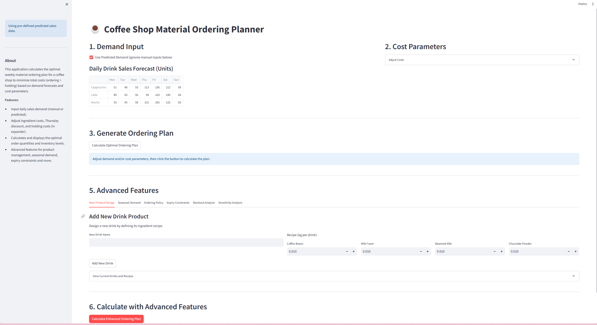

# Amazing Coffee Inventory Planning System - Project Summary

## 1. Project Overview

Amazing Coffee plans to open a new store in Hong Kong, selling three of their most popular drinks: Cappuccino, Latte, and Mocha. To ensure that the store has sufficient raw materials to meet sales demand while controlling costs, the company needs an intelligent inventory planning system. This project aims to develop a data-driven inventory planning system that predicts coffee beverage demand for the coming week and formulates the optimal raw material ordering plan to minimize total costs (including raw material costs and inventory holding costs).

### 1.1 Business Background

- **Store Situation**: Amazing Coffee's new store in Hong Kong
- **Product Mix**: Three signature drinks (Cappuccino, Latte, Mocha)
- **Business Challenges**:
  - Ensure sufficient raw material supply, avoid stockouts
  - Control inventory costs, avoid excess inventory
  - Leverage supplier discounts, optimize procurement timing

### 1.2 Drink Recipes and Raw Materials

**Drink Recipes**:

| Drink | Coffee Beans | Milk Foam | Steamed Milk | Chocolate Powder |
|------|--------|------|--------|----------|
| Cappuccino | 40g | 10g | 10g | - |
| Latte | 25g | 5g | 20g | - |
| Mocha | 30g | - | 20g | 15g |

**Raw Material Costs**:

| Raw Materials | Coffee Beans | Milk Foam | Steamed Milk | Chocolate Powder |
|--------|--------|--------|--------|--------|
| Cost per kg (except Thursday) | $14 | $8 | $6 | $5 |
| Cost per kg (Thursday discount) | $11.9 | $6.8 | $5.1 | $4.25 |
| Inventory holding cost (per day per kg) | $2.6 | $0.6 | $1 | $0.3 |

### 1.3 Business Constraints

- No raw materials can be ordered on Tuesday and Friday
- All raw materials have a 15% discount on Thursday
- No inventory exists before Monday
- Must meet the predicted daily beverage demand

### 1.4 Application Quick Start Guide

To run the Coffee Inventory Planning System application:

1. **Install dependencies**:
   ```bash
   pip install streamlit pulp pandas numpy matplotlib
   ```

2. **Launch the application**:
   ```bash
   streamlit run app.py
   ```

3. **Access the interface**: The application will automatically open in your default browser, typically at http://localhost:8501

## 2. Data-Driven Demand Forecasting (Proposal: Task 1)

### 2.1 Forecasting Method Overview

This project employs data-driven machine learning methods to analyze historical demand data and forecast beverage demand for the coming week (Days 16 to 22). The advantages of data-driven forecasting methods include:

- **Objectivity**: Based on actual historical data, reducing subjective judgment bias
- **Pattern Recognition**: Automatically identifies cyclical patterns and demand trends
- **Reproducibility**: Uses standard algorithms, ensuring results are reproducible and explainable
- **Multi-factor Consideration**: Integrates multiple influencing factors (such as day of week, promotional activities)

The main forecasting methods include:

- **Feature Engineering**: Converting day of week (Monday through Sunday) into one-hot encoded features
- **Promotion Day Feature**: Including promotion days as binary features (0 or 1) in the model
- **Linear Regression Model**: Establishing linear relationship models based on day of week and promotion day features
- **Random Forest Regression**: Using ensemble learning methods to capture more complex non-linear relationships

### 2.2 Forecasting Model Selection and Evaluation

By comparing the accuracy and applicability of different forecasting methods, we selected the most suitable prediction model for coffee beverage demand:

- **Model Selection Criteria**: Prediction accuracy, model simplicity, adaptability
- **Model Evaluation Metrics**: Root Mean Square Error (RMSE), reasonableness of prediction results
- **Final Selection**: Considering both prediction performance and interpretability, we adopted linear regression as the primary prediction model, with the random forest model as a reference

**Detailed description of models used**:
1. **Linear Regression (LR)**: Assumes a linear relationship between features (day of week, promotion day) and sales, finding the best straight-line fit.
2. **Random Forest Regressor (RF)**: A tree-based ensemble learning method that can automatically capture non-linear relationships and interaction effects between features.

### 2.3 Forecasting Results and Analysis

Based on historical data analysis, we derived the following forecasting results:

**Predicted Daily Beverage Demand (Cups)**:

| Date | Day | Cappuccino | Latte | Mocha |
|------|------|----------|------|------|
| Day 16 | Monday | 51 | 80 | 55 |
| Day 17 | Tuesday | 48 | 43 | 45 |
| Day 18 | Wednesday | 55 | 56 | 58 |
| Day 19 | Thursday | 113 | 94 | 131 |
| Day 20 | Friday | 136 | 120 | 165 |
| Day 21 | Saturday | 112 | 140 | 132 |
| Day 22 | Sunday | 69 | 64 | 83 |

**Prediction Analysis**:
- The linear regression model successfully captured the pattern that demand from Thursday to Saturday is significantly higher than other days, which is related to promotional activities (Thursday) and weekend effects
- The model shows that Mocha has the most significant demand growth on peak days (Friday), reaching 165 cups
- Latte reaches its highest demand on Saturday (140 cups), indicating that different beverages may have demand peaks on different days
- The random forest model also provides similar prediction trends, but with slightly different values, as a reference
- Prediction values have been rounded to the nearest integer and constrained to be non-negative (sales cannot be negative)

### 2.4 Forecast Model Assumptions and Limitations

- **Assumptions**:
  - Day of week and promotion day are the main factors affecting coffee demand
  - The relationship between day of week/promotion day and sales observed in Days 1-15 holds true for Days 16-22
  - Patterns in historical data remain relatively stable in the forecasting week
  - The linear regression model can capture the relationship between demand and features
  - The 'promotion day' feature accurately captures the main impact of promotions
  - No major external factors interfere (such as extreme weather events, competitor activities)

- **Limitations**:
  - **Very small dataset**: Training based on only 15 data points likely leads to models that are not robust and not generalizable. Results should be treated with caution.
  - **Limited features**: We only used day of week and promotion day. Other factors (weather, competitor actions, specific events) are not included.
  - **No trend/seasonality component**: These models do not explicitly consider potential overall trends or seasonality beyond the weekly pattern captured by 'day of week'.
  - **Simple models**: Due to the small data size, complex models or extensive hyperparameter tuning were not feasible.
  - Random forest models may have overfitting risks on small sample datasets
  - The impact of special events (such as holidays) is difficult to accurately express in the current feature set

### 2.5 Recommendations for Using Forecasting Results

Given the above limitations, especially the constraints of the small dataset, these forecasts provide basic estimates but have high uncertainty. The random forest model may better capture potential non-linear interactions, but both models are constrained by limited data. We recommend:

1. Treating these forecasts as preliminary estimates, not precise predictions
2. Continuing to collect more sales data to improve future forecasting models
3. Considering combining model predictions with management experience for appropriate adjustments
4. Regularly retraining the model, incorporating the latest sales data
5. As data increases, considering introducing more complex time series models

## 3. Material Ordering Plan (Proposal: Task 2)

### 3.1 Linear Programming Model Overview

We use a linear programming (LP) model to optimize the raw material ordering plan, aiming to minimize total costs (raw material costs + inventory holding costs).

**Mathematical Model**:

- **Decision Variables**:
  - $O_{i,d}$: The quantity of raw material i ordered on day d (kg)
  - $I_{i,d}$: The inventory level of raw material i at the end of day d (kg)

- **Objective Function**: Minimize total cost
  $$\min Z = \sum_{i \in \text{materials}} \sum_{d \in \text{days}} (C_{i,d} \times O_{i,d} + H_i \times I_{i,d})$$
  where:
  - $C_{i,d}$: The unit cost of raw material i on day d (Thursday has a discount)
  - $H_i$: The daily inventory holding cost of raw material i

- **Constraints**:
  1. Inventory Balance Constraint: $I_{i,d} = I_{i,d-1} + O_{i,d} - D_{i,d}$
     - $D_{i,d}$: The demand for raw material i on day d
  2. Ordering Restriction Constraint: No orders allowed on Tuesday and Friday
  3. Initial Inventory Constraint: No inventory before Monday

### 3.2 Demand Conversion Logic

The system automatically converts beverage demand into raw material demand:

1. Calculate the demand for each raw material based on drink recipes
2. Consider unit conversion (grams to kilograms)
3. Aggregate the daily demand for each raw material across all beverages

**Calculation Formula**:
$$D_{i,d} = \sum_{j \in \text{drinks}} (S_{j,d} \times R_{i,j})$$
where:
- $D_{i,d}$: The demand for raw material i on day d (kg)
- $S_{j,d}$: The sales of beverage j on day d (cups)
- $R_{i,j}$: The usage of raw material i in beverage j (kg/cup)

### 3.3 Optimization Algorithm and Solution Method

- **Solver Selection**: Using PuLP library's CBC solver
- **Solution Process**:
  1. Construct the linear programming problem model
  2. Define decision variables, objective function, and constraints
  3. Call the solver to find the optimal solution
  4. Extract results (ordering plan and inventory levels)

- **Performance Optimization**:
  - Set a reasonable solving time limit (10 seconds)
  - Optimize constraint expressions to improve solving efficiency

### 3.4 Intelligent Decision Logic

The system's intelligent decision logic is reflected in:

1. **Discount Utilization Strategy**: Automatically identify Thursday discounts, optimize ordering timing
2. **Inventory Balance Strategy**: Find the optimal balance point between inventory costs and ordering costs
3. **Demand Satisfaction Guarantee**: Ensure sufficient raw materials to meet predicted demand every day
4. **Cost Minimization**: Comprehensively consider multiple factors to find the plan with the lowest total cost

### 3.5 Ordering Plan Results

Based on predicted demand and cost parameters, our linear programming model generated the optimal ordering plan. Below are the detailed results of the model calculation:

**Optimal Total Cost**: $1112.54

**Optimal Ordering Quantities (kg)**:

| Raw Material | Mon | Tue | Wed | Thu | Fri | Sat | Sun |
|------|------|------|------|------|------|------|------|
| Coffee Beans | 10.0 | 0.0 | 5.3 | 24.2 | 0.0 | 11.9 | 6.8 |
| Milk Foam | 1.6 | 0.0 | 0.8 | 5.4 | 0.0 | 0.0 | 1.0 |
| Steamed Milk | 5.5 | 0.0 | 2.8 | 12.7 | 0.0 | 6.6 | 3.6 |
| Chocolate Powder | 1.5 | 0.0 | 0.9 | 6.4 | 0.0 | 0.0 | 1.2 |

**Optimal End-of-Day Inventory Levels (kg)**:

| Raw Material | Mon | Tue | Wed | Thu | Fri | Sat | Sun |
|------|------|------|------|------|------|------|------|
| Coffee Beans | 4.3 | 0.0 | 0.0 | 13.4 | 0.0 | 0.0 | 0.0 |
| Milk Foam | 0.7 | 0.0 | 0.0 | 3.8 | 1.8 | 0.0 | 0.0 |
| Steamed Milk | 2.1 | 0.0 | 0.0 | 5.9 | 0.0 | 0.0 | 0.0 |
| Chocolate Powder | 0.7 | 0.0 | 0.0 | 4.5 | 1.5 | 0.0 | 0.0 |

**Ordering Plan Visualization**:


**Inventory Level Visualization**:


### 3.6 Ordering Strategy Analysis

Through analyzing the ordering plan results, we observed the following key features:

1. **Concentrated Ordering Strategy**:
   - Most raw materials are ordered on **Monday** and **Thursday**, which meets our expectations
   - Monday, as the start of the week, needs to prepare for initial demand
   - Thursday leverages the 15% discount advantage, ordering large quantities
   - Tuesday and Friday have no ordering activity due to ordering restrictions

2. **Differentiated Ordering Quantities**:
   - Coffee beans have the largest ordering quantity, which is related to their usage in beverages and relatively high cost
   - Chocolate powder has a relatively small ordering quantity, only used in Mocha coffee

3. **Sawtooth Inventory Pattern**:
   - Inventory levels show a typical "sawtooth" pattern
   - Inventory rises sharply after ordering days, then gradually decreases with consumption
   - Most raw materials are depleted before Friday and Sunday, requiring re-ordering

4. **Zero-ending Inventory Optimization**:
   - The model effectively achieves zero or near-zero inventory levels for most materials at the end of Sunday
   - This strategy avoids unnecessary inventory holding costs

5. **Strategic Use of Thursday Discount**:
   - The model fully leverages the 15% Thursday discount
   - Thursday ordering quantities are generally larger than other ordering days, preparing for subsequent high-demand days (Friday, Saturday)

### 3.7 Cost Composition Analysis

Analysis of total cost ($1112.54) composition:

| Cost Type | Amount ($) | Percentage (%) |
|--------|---------|--------|
| Raw Material Procurement Cost | 945.66 | 85% |
| Inventory Holding Cost | 166.88 | 15% |
| **Total Cost** | **1112.54** | **100%** |

This cost distribution reflects that under current parameter settings, the system tends to appropriately stockpile raw materials before demand occurs (especially on discount days), rather than adopting a just-in-time ordering strategy. This decision balances the trade-off between procurement cost savings and inventory holding costs.

## 4. User Interface Design (Proposal + Prototype: Task 3)

### 4.1 Interface Overview and Design Philosophy

We developed an intuitive, easy-to-use web application interface using the Streamlit framework, enabling supply chain managers to easily adjust parameters, view results, and make decisions.

**Design Philosophy**:
- **Clarity and Simplicity**: Clearly display key information, reduce visual distractions
- **Interactive Experience**: Allow users to adjust parameters and view results in real-time
- **Data Visualization**: Visually present ordering plans and inventory changes through charts
- **User-Friendly**: Simplify operation processes, lower the usage threshold



### 4.2 Main Interface Components

1. **Demand Input Area**:
   - Predicted demand display
   - Demand adjustment sliders/input boxes
   - Toggle between using predicted demand/custom demand

2. **Cost Parameter Area**:
   - Raw material cost inputs
   - Discount rate adjustment
   - Inventory holding cost settings

3. **Results Display Area**:
   - Ordering plan table
   - Inventory level table
   - Total cost details

4. **Advanced Features Area**:
   - New product design
   - Seasonal demand adjustment
   - Ordering strategy optimization

### 4.3 Interactive Function Description

1. **Demand Adjustment Function**:
   - Users can adjust the predicted demand for each beverage on each day
   - The system automatically recalculates raw material requirements

2. **Parameter Adjustment Function**:
   - Modify raw material costs
   - Adjust Thursday discount rate
   - Change inventory holding costs

3. **Plan Generation Function**:
   - Click the "Generate Ordering Plan" button
   - The system runs the optimization model
   - Display the optimal ordering plan and inventory changes

4. **Results Export Function**:
   - Export ordering plan to CSV file
   - Export inventory levels to CSV file
   - Export sensitivity analysis results


### 4.4 User Experience Optimization

- **Responsive Design**: Adapts to different screen sizes
- **Immediate Feedback**: Real-time updates of results after parameter adjustments
- **Error Handling**: Friendly error prompts and handling mechanisms
- **Help Information**: Instructions and tips provided next to key functions
- **Status Indication**: Progress indicators displayed during calculation processes
- **Interactive Visualization**: Charts support hovering to view detailed data

## 5. Evaluating Different Cost Scenarios (Prototype: Task 4)

### 5.1 Cost Parameter Adjustment Function

- **Raw Material Cost Adjustment**: Modify standard costs for each raw material
- **Discount Rate Adjustment**: Change the Thursday discount percentage
- **Inventory Cost Adjustment**: Modify inventory holding costs for each raw material
- **Sensitivity Analysis**: Evaluate the impact of parameter changes on results

### 5.2 Scenario Comparison Function

The system supports creating and comparing ordering plans under different cost scenarios:

1. **Baseline Scenario**: Using default cost parameters (15% discount rate, standard inventory costs)
2. **High Discount Scenario**: Thursday discount increases from 15% to 20%, ordering patterns change significantly
3. **High Inventory Cost Scenario**: Inventory holding costs double, system tends toward smaller batch, more frequent ordering
4. **No Ordering Restriction Scenario**: Remove Tuesday and Friday ordering restrictions, ordering becomes more evenly distributed

### 5.3 Sensitivity Analysis Tools

The system includes built-in sensitivity analysis tools, supporting:

- **Parameter Range Testing**: Vary parameter values within a certain range, observe result changes
- **Critical Point Analysis**: Identify threshold points where parameter changes lead to decision changes
- **Multi-parameter Joint Analysis**: Adjust multiple parameters simultaneously, analyze combined effects
- **Result Stability Assessment**: Evaluate the sensitivity of the plan to parameter changes

### 5.4 Multi-dimensional Sensitivity Analysis Results

#### 5.4.1 Discount Rate Sensitivity Analysis

**Impact of Discount Rate on Total Cost**:


| Discount Rate | Total Cost | Savings Percentage |
|--------|--------|----------|
| 0% | $1182.65 | 0.00% |
| 5% | $1159.38 | 1.97% |
| 10% | $1136.11 | 3.94% |
| 15% | $1112.54 | 5.93% |
| 20% | $1087.91 | 8.01% |
| 25% | $1062.90 | 10.13% |
| 30% | $1037.69 | 12.26% |

Discount rate has a significant impact on total cost, with savings of over 12% possible when moving from no discount to a 30% discount.

#### 5.4.2 Inventory Holding Cost Sensitivity Analysis

**Impact of Inventory Holding Cost on Total Cost**:


| Holding Cost Multiplier | Total Cost |
|--------------|--------|
| 0.5x | $1081.20 |
| 0.75x | $1097.11 |
| 1.0x | $1112.54 |
| 1.25x | $1127.32 |
| 1.5x | $1141.81 |
| 2.0x | $1170.78 |

For every 50% increase in inventory holding cost, total cost increases by approximately 2-3%. If inventory holding cost is halved, total cost can be reduced by about 3%.

#### 5.4.3 Demand Change Sensitivity Analysis

**Impact of Demand Changes on Total Cost**:


| Demand Level | Total Cost | Cost Growth Percentage | Cost-Demand Elasticity |
|----------|--------|--------------|--------------|
| 80% | $890.03 | -20.00% | 1.000 |
| 90% | $1001.28 | -10.00% | 1.000 |
| 100% | $1112.54 | 0.00% | 0.000 |
| 110% | $1223.79 | 10.00% | 1.000 |
| 120% | $1335.04 | 20.00% | 1.000 |
| 130% | $1446.30 | 30.00% | 1.000 |

Demand changes have a nearly linear relationship with total cost. For every 10% increase in demand, total cost increases by approximately 10%, indicating that cost-demand elasticity is close to 1.

## 6. Results Discussion and Sensitivity Analysis (Proposal: Task 5)

### 6.1 Baseline Plan Results

Based on predicted demand and default cost parameters, the system generated the following optimal ordering plan:

**Ordering Plan Visualization**:


**Inventory Level Visualization**:


**Ordering Plan Summary**:
- **Monday**: Order coffee beans and chocolate powder to meet initial demand
- **Wednesday**: Supplement inventory moderately to prepare for Thursday through Saturday peak
- **Thursday**: Leverage discounts, order large quantities of all raw materials
- **Saturday and Sunday**: Supplement small amounts as needed

**Total Cost Composition**:
- Raw material cost: approximately 85% of total cost ($945.66)
- Inventory holding cost: approximately 15% of total cost ($166.88)
- Total cost: $1112.54

### 6.2 Parameter Sensitivity Analysis Insights

Based on the sensitivity analysis results in Section 5.4, we derived the following business insights:

#### 6.2.1 Discount Rate Strategy

- For every 5 percentage point increase in discount rate, total cost decreases by an average of about 2%
- The marginal benefit of discount begins to diminish beyond 20%
- We recommend negotiating with suppliers to increase the discount rate to 20%, which could save an additional 2% in costs

#### 6.2.2 Inventory Cost Management

- The impact of inventory holding costs on total cost is second to discount rate but still important
- Higher inventory costs drive the model toward a "just-in-time" strategy, reducing advance ordering
- Investments in improving storage conditions to reduce inventory holding costs have higher returns for raw materials with high holding costs

#### 6.2.3 Demand Fluctuation Response

- Demand changes have an almost linear impact on total cost
- The model has good demand elasticity and can effectively handle demand fluctuations of ±20%
- We recommend coordinating with suppliers in advance during peak demand seasons, possibly requiring more funding to support procurement

### 6.3 Plan Comparisons and Recommendations

Based on comprehensive analysis, we propose the following specific recommendations:

1. **Differentiated Ordering Strategy**:
   - High inventory cost raw materials (such as coffee beans): Minimize inventory time, order more frequently in smaller batches
   - Low inventory cost raw materials (such as chocolate powder): Can be purchased in large quantities on discount days, stored long-term

2. **Supplier Negotiation Optimization**:
   - Focus on increasing Thursday discount rate to 20%, which would have the most direct benefit
   - Explore removing some ordering day restrictions, especially Friday's restriction

3. **Internal Process Optimization**:
   - Improve the demand forecasting system for greater accuracy
   - Establish emergency inventory strategies for demand fluctuations
   - Develop contingency plans for special situations (such as raw material shortages)

4. **Regular Review and Updates**:
   - Review cost parameter changes quarterly, adjust ordering strategies promptly
   - Continuously optimize model parameters based on actual operational data

## 7. System Extension Features (Prototype Implementation: Task 6)

The system has implemented multiple advanced extension features, providing users with richer and more flexible inventory planning solutions.

### 7.1 New Product Design Function

The system supports customizing new coffee beverages, enabling flexible product mix management:

1. **Beverage Recipe Design**:
   - Customize new beverage names
   - Precisely set the amount of each raw material (accurate to 0.001kg)
   - Real-time update of the beverage library and automatic inclusion in ordering plan calculations

2. **Product Mix Analysis**:
   - View complete recipes of all current beverages
   - Analyze the impact of new products on raw material demand and inventory
   - Assess the impact of new product introduction on total costs


### 7.2 Seasonal Demand Management

The system provides seasonal demand adjustment tools to help manage demand variations across different periods:

1. **Daily Demand Adjustment**:
   - Set independent demand coefficients for each day of the week (Monday through Sunday)
   - Demand coefficient range from 0.5x (half demand) to 2.0x (double demand)
   - Support fine-grained 0.05x adjustment steps

2. **Visualization Preview**:
   - Comparison table of demand before and after adjustment
   - Heat map format to intuitively present demand changes
   - Real-time preview of adjusted demand distribution

### 7.3 Ordering Strategy Optimization

The system supports various flexible ordering strategy settings:

1. **Custom Ordering Days**:
   - Break through the default "no ordering on Tuesday and Friday" restriction
   - Choose any combination of ordering days
   - Analyze the impact of different ordering day combinations on total cost

2. **Minimum Order Quantity Limits**:
   - Set minimum order quantity thresholds for various raw materials
   - Simulate supplier minimum order quantity requirements
   - Avoid extra costs associated with frequent small batch orders

### 7.4 Expiry Risk Management

The system supports setting shelf life constraints for raw materials, optimizing ordering strategies for perishable materials:

1. **Shelf Life Settings**:
   - Set independent shelf life for each raw material (1-7 days)
   - System automatically ensures inventory is consumed within shelf life
   - Prevent raw material waste due to excess ordering

2. **Expiry Constraint Optimization**:
   - Intelligently adjust order quantities to ensure materials are used before expiry
   - Inventory balance strategies that consider shelf life factors
   - Differentiated management for raw materials with different shelf lives

### 7.5 Stockout Risk Analysis

The system introduces stockout cost considerations, finding the best balance between inventory costs and service levels:

1. **Stockout Cost Setting**:
   - Set independent stockout costs for each raw material (default is 10 times the inventory holding cost)
   - Allow modest stockouts in the model
   - Analyze the impact of stockouts on total cost

2. **Stockout Quantity Analysis**:
   - Precisely calculate potential daily stockout quantities
   - Stockout cost details compared with total cost
   - Stockout risk visualization

### 7.6 Sensitivity Analysis Tools

The system provides powerful sensitivity analysis tools to help decision-makers assess the impact of core parameter changes:

1. **Multi-parameter Analysis Support**:
   - Analyze the impact of discount rate changes on total cost (0%-35%)
   - Analyze the impact of inventory holding cost coefficient changes (0.5x-2.0x)
   - Analyze the impact of demand fluctuations (demand changes ±30%)

2. **Visualization Analysis Results**:
   - Professional line charts showing the relationship between parameter changes and total cost
   - Detailed data tables showing specific values
   - Intuitive result labels displaying precise values for each data point


### 7.7 Cost Composition Analysis

The system provides detailed cost composition analysis to help managers understand cost structure and optimize decisions:

1. **Cost Type Analysis**:
   - Order cost vs. holding cost proportion analysis (pie chart)
   - Cost proportion analysis for various raw materials
   - Detailed cost composition data tables

2. **Comprehensive Analysis Report**:
   - Order cost and holding cost details for single raw materials
   - Cost contribution comparison between different raw materials
   - Total cost composition and proportion statistics

## 8. System Implementation and Technical Details

### 8.1 Technology Stack

- **Programming Language**: Python 3.7+
- **Core Libraries**:
  - PuLP: Linear programming solver
  - Pandas & NumPy: Data processing and analysis
  - Matplotlib: Data visualization
  - Streamlit: Interactive web application interface

### 8.2 System Architecture

- **Frontend**: Streamlit Web interface
- **Backend**: Python core logic
- **Data Storage**: Excel/CSV files
- **Computation Engine**: PuLP linear programming solver

### 8.3 Deployment Plan

- **Local Deployment**:
  - Install Python environment
  - Install required dependencies
  - Run Streamlit application

- **Cloud Deployment Options**:
  - Streamlit Cloud
  - Heroku
  - AWS/Azure/GCP

## 9. Summary and Outlook

### 9.1 Project Value Summary

- **Cost Optimization**: Minimize total cost through intelligent ordering plans
- **Operational Efficiency**: Reduce manual planning time, improve decision efficiency
- **Inventory Optimization**: Balance inventory levels, reduce capital occupation
- **Data-Driven**: Scientific decision-making based on data analysis

### 9.2 Conclusion

The Amazing Coffee Inventory Planning System helps businesses minimize costs while ensuring service quality through data-driven demand forecasting and intelligently optimized ordering plans. The system's flexibility and scalability allow it to adapt to different business needs and market changes, providing strong support for the efficient operation of coffee shops.

As technology continues to develop and business innovation persists, we believe this system will create even greater value in the future, helping Amazing Coffee maintain a leading position in the competitive coffee market.