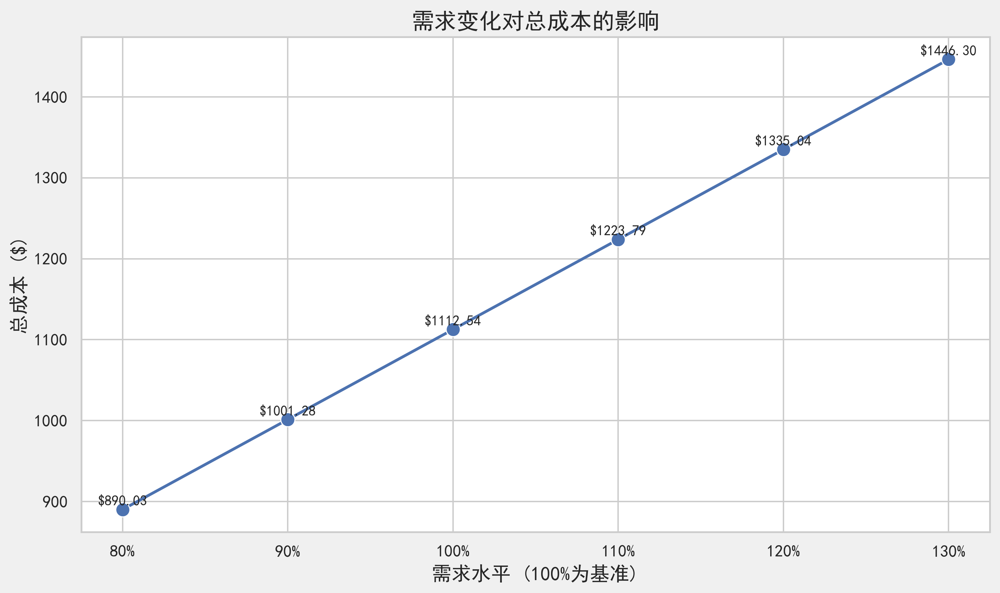
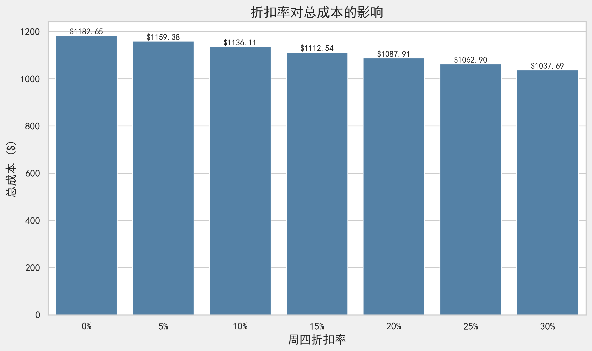

# Amazing Coffee 咖啡库存规划系统 研究报告

## 目录
1. 项目简介
2. 任务一：数据驱动的需求预测（提案）
3. 任务二：物料订购计划（提案）
4. 任务三：用户界面设计（提案+原型）
5. 任务四：评估不同成本场景的功能（原型）
6. 任务五：结果讨论与敏感性分析（提案）
7. 任务六：扩展推荐（可选，提案+原型）
8. 总结与展望

---

## 1. 项目简介

本项目为Amazing Coffee公司开发的智能库存规划系统，旨在通过数据驱动的需求预测与线性规划优化订购计划，帮助新开门店在满足销售需求的同时，最小化原材料采购与库存持有成本。系统支持多种高级功能，包括敏感性分析、季节性调整、新产品设计、缺货与过期风险管理等。

**主要技术栈**：Python 3.7+，PuLP，Pandas，NumPy，Matplotlib，Streamlit。

**系统界面预览**：

---

## 2. 任务一：数据驱动的需求预测（提案）

### 2.1 任务目标
- 基于历史销售数据，预测未来一周（第16-22天）三款主打饮品的每日需求。

### 2.2 实现思路与方法
- 采用**线性回归（LR）** 和 **随机森林回归（RF）**两种机器学习模型，输入特征为星期几、是否促销日。
- 预测流程包括数据清洗、特征工程、模型训练、交叉验证与结果评估。
- 预测方法详见`6111project_中文.ipynb`，核心结论与表格见`README.md`第2章。

### 2.3 关键代码文件
- `6111project_中文.ipynb`：数据处理、特征工程、模型训练与预测。
- `README.md`：详细展示预测表格与分析。

### 2.4 主要结果与可视化
- **预测结果对比表**：

| 天数 | 星期 | 促销日 | 卡布奇诺(LR) | 卡布奇诺(RF) | 拿铁(LR) | 拿铁(RF) | 摩卡(LR) | 摩卡(RF) |
|------|------|--------|--------------|--------------|----------|----------|----------|----------|
| 16   | 周一 | 否     | 51           | 53           | 80       | 77       | 55       | 57       |
| 17   | 周二 | 否     | 48           | 48           | 43       | 45       | 45       | 46       |
| 18   | 周三 | 否     | 55           | 55           | 56       | 58       | 58       | 55       |
| 19   | 周四 | 是     | 113          | 112          | 94       | 96       | 131      | 128      |
| 20   | 周五 | 是     | 136          | 134          | 120      | 122      | 165      | 162      |
| 21   | 周六 | 是     | 112          | 114          | 140      | 138      | 132      | 134      |
| 22   | 周日 | 否     | 69           | 67           | 64       | 65       | 83       | 81       |

- **需求预测趋势可视化**：

- **分析与结论**：
  - 两种模型均能捕捉促销日和周末的高需求特征，预测结果高度一致。
  - 由于数据量较小，最终采用线性回归模型，兼顾稳定性与可解释性。

### 2.5 创新与亮点
- 结合促销日、周末等业务特征，提升预测准确性。
- 预测结果直接驱动后续订购计划优化。

---

## 3. 任务二：物料订购计划（提案）

### 3.1 任务目标
- 制定一周内各原材料的最优订购时间与数量，最小化总成本（采购+持有）。

### 3.2 实现思路与方法
- 建立**线性规划（LP）模型**，决策变量为每日各原料订购量与库存量。
- 约束包括：库存平衡、订购禁令（周二/周五）、初始无库存、满足每日需求。
- 关键数学模型、变量定义、目标函数详见`README.md` 3.1节。

### 3.3 关键代码文件
- `app.py`：核心LP建模与求解（`solve_ordering_plan`函数），参数灵活可调。
- `README.md`、`README_EN.md`：模型公式、约束、结果展示。

### 3.4 主要结果与可视化
- **最优订购计划表**：

| 原料 | 周一 | 周二 | 周三 | 周四 | 周五 | 周六 | 周日 |
|------|------|------|------|------|------|------|------|
| 咖啡豆 | 10.0 | 0.0 | 5.3 | 24.2 | 0.0 | 11.9 | 6.8 |
| 奶泡 | 1.6 | 0.0 | 0.8 | 5.4 | 0.0 | 0.0 | 1.0 |
| 蒸牛奶 | 5.5 | 0.0 | 2.8 | 12.7 | 0.0 | 6.6 | 3.6 |
| 巧克力粉 | 1.5 | 0.0 | 0.9 | 6.4 | 0.0 | 0.0 | 1.2 |

- **最优库存水平表**：

| 原料 | 周一 | 周二 | 周三 | 周四 | 周五 | 周六 | 周日 |
|------|------|------|------|------|------|------|------|
| 咖啡豆 | 4.3 | 0.0 | 0.0 | 13.4 | 0.0 | 0.0 | 0.0 |
| 奶泡 | 0.7 | 0.0 | 0.0 | 3.8 | 1.8 | 0.0 | 0.0 |
| 蒸牛奶 | 2.1 | 0.0 | 0.0 | 5.9 | 0.0 | 0.0 | 0.0 |
| 巧克力粉 | 0.7 | 0.0 | 0.0 | 4.5 | 1.5 | 0.0 | 0.0 |

- **订购计划与库存可视化**：

- **订购策略分析**：
  - 充分利用周四折扣，集中采购高峰日原料。
  - 库存呈锯齿形变化，周末前后库存趋于零，降低持有成本。

### 3.5 创新与亮点
- 支持多种业务约束（禁订购日、促销日折扣等）。
- 订购计划自动适应需求预测结果。

---

## 4. 任务三：用户界面设计（提案+原型）

### 4.1 任务目标
- 开发直观易用的Web界面，支持需求输入、参数调整、结果展示与导出。

### 4.2 实现思路与方法
- 采用**Streamlit**框架，前后端一体化。
- 主要界面区块：需求输入、成本参数、结果展示、高级功能区。
- 交互功能：需求调整、参数修改、计划生成、结果导出。

### 4.3 关键代码文件
- `app.py`：全部界面与交互逻辑。
- `README.md`、`SUMMARY.md`：界面设计理念与功能说明。
- `fig/UI_Preview.png`、`UI_Preview_Output.jpg`：界面截图。

### 4.4 主要结果与可视化
- **界面截图**：

- **功能亮点**：
  - 支持手动/预测需求输入，参数灵活调整。
  - 结果表格、折线图、饼图等多种可视化。
  - 导出功能：订购计划、库存水平、敏感性分析结果均可导出。

### 4.5 创新与亮点
- 响应式设计，参数调整后结果实时刷新。
- 支持新产品设计、季节性调整等高级功能。

---

## 5. 任务四：评估不同成本场景的功能（原型）

### 5.1 任务目标
- 支持用户自定义原料成本、折扣率、库存持有成本，评估不同场景下的订购策略与总成本。

### 5.2 实现思路与方法
- 所有成本参数均可在界面中动态调整，系统自动重新计算最优订购计划。
- 内置敏感性分析工具，支持多参数联动分析。

### 5.3 关键代码文件
- `app.py`：参数输入、敏感性分析（run_sensitivity_analysis等函数）。
- `README.md` 5.1-5.4节：功能说明与结果展示。
- `visualizations_cn/discount_sensitivity_cost.png`等：敏感性分析图表。

### 5.4 主要结果与可视化
- **折扣率敏感性分析**：

- **库存持有成本敏感性分析**：

- **需求变化敏感性分析**：

- **多场景对比表格与图表**，辅助决策。

### 5.5 创新与亮点
- 支持多维度参数敏感性分析，结果可视化直观。
- 场景切换便捷，适应实际业务需求变化。

---

## 6. 任务五：结果讨论与敏感性分析（提案）

### 6.1 任务目标
- 分析基准方案结果，讨论参数变化对订购策略和成本的影响，提出业务建议。

### 6.2 实现思路与方法
- 基于敏感性分析结果，系统性讨论折扣、持有成本、需求波动等因素的影响。
- 结合可视化图表，给出业务洞察。

### 6.3 关键代码文件
- `README.md` 6.1-6.3节：结果讨论与建议。
- `app.py`：敏感性分析功能。

### 6.4 主要结果与可视化
- **折扣率提升可显著降低总成本**，持有成本增加促使订购更分散。
- **需求变化与总成本近线性关系**，模型具备良好弹性。
- **业务建议**：高峰期提前协调供应商，合理利用折扣日。
- **可视化示例**：

---

## 7. 任务六：扩展推荐（可选，提案+原型）

### 7.1 任务目标
- 探索并实现更多实际业务场景下的扩展功能。

### 7.2 实现思路与方法
- 新产品设计：支持自定义饮品及配方，自动纳入订购计划。
- 季节性需求管理：每日需求可按季节因子调整。
- 订购策略优化：支持自定义订购日、最小订购量。
- 过期风险管理：原料保质期约束，防止浪费。
- 缺货风险分析：引入缺货成本，平衡服务水平与库存。

### 7.3 关键代码文件
- `app.py`：所有扩展功能均有对应tab实现。
- `README.md` 7.1-7.7节：功能说明与代码片段。

### 7.4 主要结果与可视化
- **新产品设计界面**：

- **敏感性分析、成本分布饼图、库存变化热力图等多样可视化**。
- **高级功能区截图**：

### 7.5 创新与亮点
- 功能高度模块化，便于扩展。
- 贴合实际业务场景，提升系统实用性与灵活性。

---

## 8. 总结与展望

本项目实现了从需求预测、订购优化到多场景敏感性分析与高级扩展的全流程智能库存管理。系统界面友好、功能丰富，支持多种实际业务约束与创新场景。未来可进一步引入更复杂的时间序列预测、供应链协同优化等功能，持续提升决策智能化水平。

**主要参考文件**：
- `README.md`、`README_EN.md`、`SUMMARY.md`、`plan.md`
- `app.py`、`6111project_中文.ipynb`
- `fig/`、`visualizations_cn/` 等可视化图片

如需更详细的代码实现或功能演示，请参考上述文件或直接运行`app.py`体验完整系统。