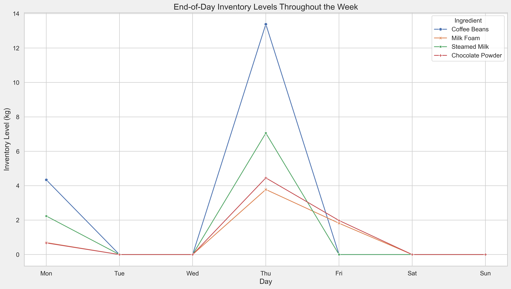
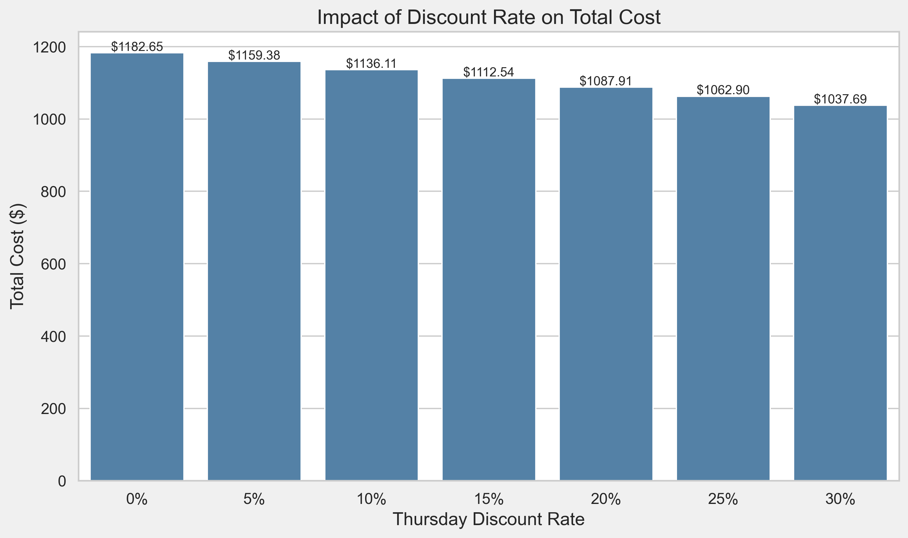

# Amazing Coffee Inventory Planning System - Research Report

## Table of Contents
1. Project Overview
2. Task 1: Data-Driven Demand Forecasting (Proposal)
3. Task 2: Material Ordering Plan (Proposal)
4. Task 3: User Interface Design (Proposal + Prototype)
5. Task 4: Evaluation of Different Cost Scenarios (Prototype)
6. Task 5: Results Discussion and Sensitivity Analysis (Proposal)
7. Task 6: System Extensions (Optional, Proposal + Prototype)
8. Conclusion and Outlook

---

## 1. Project Overview

This project is an intelligent inventory planning system developed for Amazing Coffee, aiming to minimize raw material procurement and inventory holding costs while meeting sales demand for a new store. The system features data-driven demand forecasting, linear programming-based ordering optimization, and advanced functions such as sensitivity analysis, seasonal adjustment, new product design, stockout and expiry risk management.

**Tech Stack:** Python 3.7+, PuLP, Pandas, NumPy, Matplotlib, Streamlit.

**System Interface Preview:**

---

## 2. Task 1: Data-Driven Demand Forecasting (Proposal)

### 2.1 Task Objective
- Predict daily demand for three signature drinks for the coming week (Days 16-22) based on historical sales data.

### 2.2 Implementation Approach
- Use both **Linear Regression (LR)** and **Random Forest Regression (RF)** models, with features including day of week and promotion day.
- The workflow includes data cleaning, feature engineering, model training, cross-validation, and result evaluation.
- See `6111project.ipynb` and `README_EN.md` Section 2 for details.

### 2.3 Key Code Files
- `6111project.ipynb`: Data processing, feature engineering, model training and prediction.
- `README_EN.md`: Detailed prediction tables and analysis.

### 2.4 Main Results and Visualizations
- **Prediction Comparison Table:**

| Day | Weekday | Promo | Cappuccino (LR) | Cappuccino (RF) | Latte (LR) | Latte (RF) | Mocha (LR) | Mocha (RF) |
|-----|---------|-------|-----------------|-----------------|------------|------------|------------|------------|
| 16  | Mon     | No    | 51              | 53              | 80         | 77         | 55         | 57         |
| 17  | Tue     | No    | 48              | 48              | 43         | 45         | 45         | 46         |
| 18  | Wed     | No    | 55              | 55              | 56         | 58         | 58         | 55         |
| 19  | Thu     | Yes   | 113             | 112             | 94         | 96         | 131        | 128        |
| 20  | Fri     | Yes   | 136             | 134             | 120        | 122        | 165        | 162        |
| 21  | Sat     | Yes   | 112             | 114             | 140        | 138        | 132        | 134        |
| 22  | Sun     | No    | 69              | 67              | 64         | 65         | 83         | 81         |

- **Demand Forecast Trend Visualization:**

- **Analysis & Conclusion:**
  - Both models capture the high demand on promotion days and weekends, with highly consistent results.
  - Linear regression is chosen for its stability and interpretability given the small dataset.

### 2.5 Innovations & Highlights
- Incorporates business features such as promotion days and weekends to improve accuracy.
- Forecast results directly drive subsequent ordering optimization.

---

## 3. Task 2: Material Ordering Plan (Proposal)

### 3.1 Task Objective
- Develop an optimal weekly ordering schedule for each ingredient to minimize total cost (procurement + holding).

### 3.2 Implementation Approach
- Build a **Linear Programming (LP) model** with decision variables for daily order and inventory quantities.
- Constraints include inventory balance, ordering restrictions (Tue/Fri), initial zero inventory, and daily demand fulfillment.
- See `README_EN.md` Section 3.1 for mathematical model, variables, and objective function.

### 3.3 Key Code Files
- `app.py`: Core LP modeling and solving (`solve_ordering_plan` function), with flexible parameters.
- `README_EN.md`: Model formulas, constraints, and results.

### 3.4 Main Results and Visualizations
- **Optimal Ordering Plan Table:**

| Ingredient      | Mon  | Tue  | Wed  | Thu  | Fri  | Sat  | Sun  |
|-----------------|------|------|------|------|------|------|------|
| Coffee Beans    | 10.0 | 0.0  | 5.3  | 24.2 | 0.0  | 11.9 | 6.8  |
| Milk Foam       | 1.6  | 0.0  | 0.8  | 5.4  | 0.0  | 0.0  | 1.0  |
| Steamed Milk    | 5.5  | 0.0  | 2.8  | 12.7 | 0.0  | 6.6  | 3.6  |
| Chocolate Powder| 1.5  | 0.0  | 0.9  | 6.4  | 0.0  | 0.0  | 1.2  |

- **Optimal Inventory Level Table:**

| Ingredient      | Mon  | Tue  | Wed  | Thu  | Fri  | Sat  | Sun  |
|-----------------|------|------|------|------|------|------|------|
| Coffee Beans    | 4.3  | 0.0  | 0.0  | 13.4 | 0.0  | 0.0  | 0.0  |
| Milk Foam       | 0.7  | 0.0  | 0.0  | 3.8  | 1.8  | 0.0  | 0.0  |
| Steamed Milk    | 2.1  | 0.0  | 0.0  | 5.9  | 0.0  | 0.0  | 0.0  |
| Chocolate Powder| 0.7  | 0.0  | 0.0  | 4.5  | 1.5  | 0.0  | 0.0  |

- **Ordering Plan & Inventory Visualizations:**

- **Strategy Analysis:**
  - Fully utilizes Thursday discounts and concentrates procurement for peak days.
  - Inventory shows a sawtooth pattern, approaching zero before/after weekends to reduce holding costs.

### 3.5 Innovations & Highlights
- Supports multiple business constraints (no-order days, promotion discounts, etc.).
- Ordering plan automatically adapts to demand forecasts.

---

## 4. Task 3: User Interface Design (Proposal + Prototype)

### 4.1 Task Objective
- Develop an intuitive web interface for demand input, parameter adjustment, result display, and export.

### 4.2 Implementation Approach
- Built with **Streamlit** for integrated frontend and backend.
- Main interface sections: demand input, cost parameters, results, advanced features.
- Interactive features: demand adjustment, parameter modification, plan generation, result export.

### 4.3 Key Code Files
- `app.py`: All interface and interaction logic.
- `README_EN.md`, `SUMMARY.md`: UI design concepts and feature descriptions.
- `fig/UI_Preview.png`, `UI_Preview_Output.jpg`: Interface screenshots.

### 4.4 Main Results and Visualizations
- **Interface Screenshots:**

- **Feature Highlights:**
  - Supports manual/predicted demand input and flexible parameter adjustment.
  - Multiple visualizations: tables, line charts, pie charts, etc.
  - Export functions for ordering plan, inventory levels, and sensitivity analysis results.

### 4.5 Innovations & Highlights
- Responsive design with real-time result updates.
- Advanced features: new product design, seasonal adjustment, etc.

---

## 5. Task 4: Evaluation of Different Cost Scenarios (Prototype)

### 5.1 Task Objective
- Allow users to customize ingredient costs, discount rates, and holding costs, and evaluate ordering strategies and total cost under different scenarios.

### 5.2 Implementation Approach
- All cost parameters can be dynamically adjusted in the interface, with the system automatically recalculating the optimal plan.
- Built-in sensitivity analysis tool supports multi-parameter analysis.

### 5.3 Key Code Files
- `app.py`: Parameter input, sensitivity analysis (`run_sensitivity_analysis` function, etc.).
- `README_EN.md` Sections 5.1-5.4: Feature descriptions and results.
- `visualizations_en/discount_sensitivity_cost.png`, etc.: Sensitivity analysis charts.

### 5.4 Main Results and Visualizations
- **Discount Rate Sensitivity Analysis:**

- **Holding Cost Sensitivity Analysis:**

- **Demand Change Sensitivity Analysis:**

- **Multi-scenario comparison tables and charts** to support decision-making.

### 5.5 Innovations & Highlights
- Supports multi-dimensional parameter sensitivity analysis with intuitive visualizations.
- Easy scenario switching to adapt to real business changes.

---

## 6. Task 5: Results Discussion and Sensitivity Analysis (Proposal)

### 6.1 Task Objective
- Analyze baseline results, discuss the impact of parameter changes on ordering strategy and cost, and provide business recommendations.

### 6.2 Implementation Approach
- Systematic discussion of the impact of discount, holding cost, demand fluctuation, etc., based on sensitivity analysis results.
- Business insights are supported by visualizations.

### 6.3 Key Code Files
- `README_EN.md` Sections 6.1-6.3: Results discussion and recommendations.
- `app.py`: Sensitivity analysis functions.

### 6.4 Main Results and Visualizations
- **Discount rate increases significantly reduce total cost; higher holding costs lead to more distributed ordering.**
- **Demand changes have a near-linear relationship with total cost, showing good model elasticity.**
- **Business recommendations:** Coordinate with suppliers in advance for peak periods, make full use of discount days.
- **Visualization Examples:**

---

## 7. Task 6: System Extensions (Optional, Proposal + Prototype)

### 7.1 Task Objective
- Explore and implement more advanced features for real business scenarios.

### 7.2 Implementation Approach
- New product design: support custom drinks and recipes, automatically included in ordering plan.
- Seasonal demand management: daily demand can be adjusted by seasonal factors.
- Ordering strategy optimization: support custom ordering days, minimum order quantities.
- Expiry risk management: ingredient shelf life constraints to prevent waste.
- Stockout risk analysis: introduce stockout costs to balance service level and inventory.

### 7.3 Key Code Files
- `app.py`: All extension features implemented as separate tabs.
- `README_EN.md` Sections 7.1-7.7: Feature descriptions and code snippets.

### 7.4 Main Results and Visualizations
- **New Product Design Interface:**

- **Various visualizations:** Sensitivity analysis, cost breakdown pie charts, inventory heatmaps, etc.
- **Advanced feature area screenshots:**

### 7.5 Innovations & Highlights
- Highly modular functions for easy extension.
- Closely aligned with real business scenarios, enhancing system practicality and flexibility.

---

## 8. Conclusion and Outlook

This project delivers a full-process intelligent inventory management solution, from demand forecasting and ordering optimization to multi-scenario sensitivity analysis and advanced extensions. The system features a user-friendly interface, rich functionality, and support for various business constraints and innovative scenarios. Future work may include more advanced time series forecasting, supply chain collaboration optimization, and further improvements in decision intelligence.

For more detailed code implementation or feature demonstration, please refer to the above files or run `app.py` to experience the full system.
