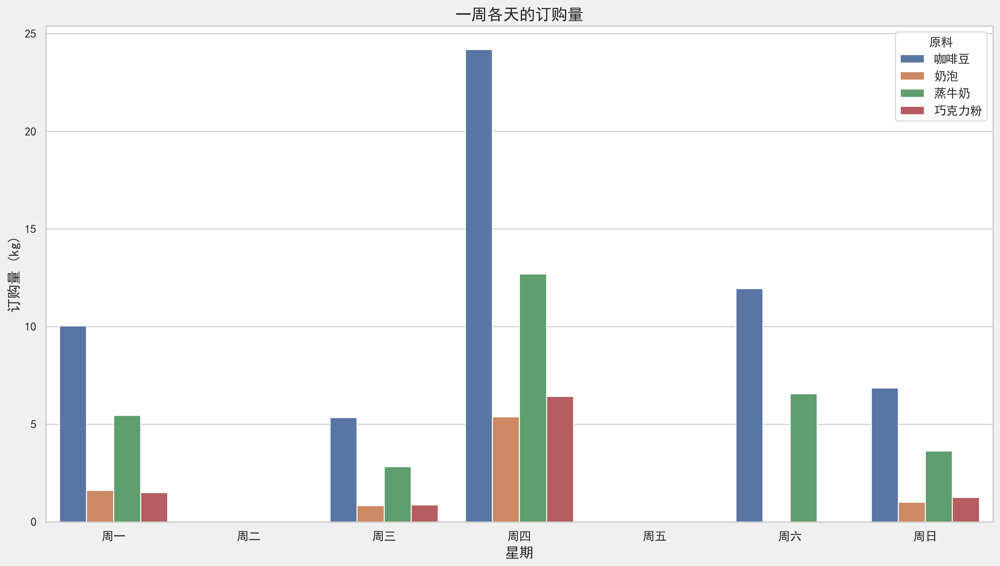
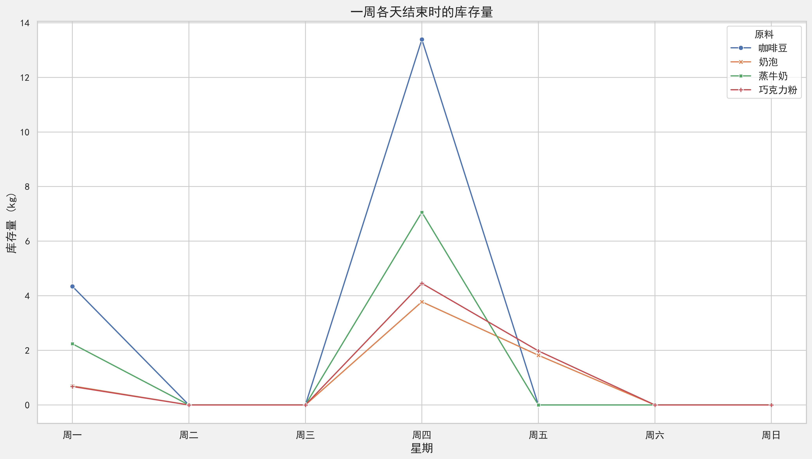

# Slide 1

## Amazing Coffee 咖啡库存规划系统 - 项目总结

1. 项目概述

Amazing Coffee计划在香港开设一家新店铺，销售三款最受欢迎的饮品：卡布奇诺、拿铁和摩卡。为了确保店内有足够的原材料满足销售需求，同时控制成本，公司需要一个智能的库存规划系统。本项目旨在开发一个基于数据驱动的库存规划系统，通过预测未来一周的咖啡饮品需求，制定最优的原材料订购计划，以最小化总成本（包括原材料成本和库存持有成本）。

# Slide 2

**饮品配方**：

| 饮品 | 咖啡豆 | 奶泡 | 蒸牛奶 | 巧克力粉 |
|------|--------|------|--------|----------|
| 卡布奇诺 | 40g | 10g | 10g | - |
| 拿铁 | 25g | 5g | 20g | - |
| 摩卡 | 30g | - | 20g | 15g |

**原材料成本**：

| 原材料 | 咖啡豆 | 奶泡 | 蒸牛奶 | 巧克力粉 |
|--------|--------|--------|--------|--------|
| 每千克成本（周四除外） | $14 | $8 | $6 | $5 |
| 每千克成本（周四折扣价） | $11.9 | $6.8 | $5.1 | $4.25 |
| 库存持有成本（每天每千克） | $2.6 | $0.6 | $1 | $0.3 |

### 1.3 业务约束条件

- 周二和周五无法订购任何原材料
- 周四原材料有15%折扣
- 周一之前不存有任何库存
- 需要满足每日预测的饮品需求

# Slide 3

## 数据驱动的需求预测（方案：任务1）
   - 作为公司代表，你需要使用数据驱动的预测方法预测下周（第 16 至 22 天）的需求。  
   - 报告你的预测模型（选择的预测方法、结果、假设和限制）。

本项目采用数据驱动的机器学习方法，分析历史需求数据，预测未来一周（第16至22天）的饮品需求。

**使用的模型详述**:
1. **线性回归(LR)**: 假设特征（星期几、促销日）与销量之间存在线性关系，寻找最佳的直线拟合。
2. **随机森林回归器(RF)**: 基于树的集成学习方法，能够自动捕捉特征之间的非线性关系和交互效应。

**预测的每日饮品需求（杯数）**：

| 日期 | 星期 | 卡布奇诺 | 拿铁 | 摩卡 |
|------|------|----------|------|------|
| 第16天 | 周一 | 51 | 80 | 55 |
| 第17天 | 周二 | 48 | 43 | 45 |
| 第18天 | 周三 | 55 | 56 | 58 |
| 第19天 | 周四 | 113 | 94 | 131 |
| 第20天 | 周五 | 136 | 120 | 165 |
| 第21天 | 周六 | 112 | 140 | 132 |
| 第22天 | 周日 | 69 | 64 | 83 |

# Slide 4

- **假设**：
  - 星期几和促销日是影响咖啡需求的主要因素
  - 第1-15天观察到的星期几/促销日与销售量之间的关系在第16-22天仍然成立
  - 历史数据中的模式在预测周内保持相对稳定
  - 线性回归模型能够捕捉需求与特征之间的关系
  - '促销日'特征准确捕捉了促销的主要影响
  - 无重大外部因素干扰（如天气极端事件、竞争对手活动）

  - **局限性**：
  - **非常小的数据集**: 仅基于15个数据点进行训练很可能导致模型不稳健且不具普遍性。结果应谨慎对待
  - **特征有限**: 我们只使用了星期几和促销日。其他因素（天气、竞争对手行动、特定事件）未包含在内
  - **无趋势/季节性组件**: 这些模型没有明确考虑潜在的总体趋势或'星期几'捕获的每周模式之外的季节性
  - **模型简单**: 由于数据规模小，无法使用复杂模型或进行广泛的超参数调优
  - 随机森林模型在小样本数据集上可能存在过拟合风险
  - 特殊事件（如节假日）的影响难以在当前特征集中准确表达

# Slide 5
**预测分析**：
- 线性回归模型成功捕捉了周四至周六需求明显高于其他日子的模式，这与促销活动（周四）和周末效应有关
- 模型显示摩卡在高峰日（周五）的需求增长最为显著，达到165杯
- 拿铁在周六达到最高需求（140杯），表明不同饮品的需求高峰可能出现在不同日子
- 随机森林模型也提供了类似的预测趋势，但数值略有差异，作为参考
- 预测值已四舍五入到最接近的整数并限制为非负（销售量不能为负）

# Slide 6

## 物料订购计划（提案：任务2）
   - 制定原材料订购计划，确定订购时间和数量，以最小化整体成本。  
   - 针对此问题制定线性规划模型。

- **决策变量**：
  - $O_{i,d}$：第d天订购的原料i的数量（千克）
  - $I_{i,d}$：第d天结束时原料i的库存量（千克）

- **目标函数**：最小化总成本
  $$\min Z = \sum_{i \in \text{原料}} \sum_{d \in \text{天数}} (C_{i,d} \times O_{i,d} + H_i \times I_{i,d})$$
  其中：
  - $C_{i,d}$：第d天原料i的单位成本（周四有折扣）
  - $H_i$：原料i的每日库存持有成本

- **约束条件**：
  1. 库存平衡约束：$I_{i,d} = I_{i,d-1} + O_{i,d} - D_{i,d}$
     - $D_{i,d}$：第d天原料i的需求量
  2. 订购限制约束：周二和周五不能订购
  3. 初始库存约束：周一之前无库存

# Slide 7

- **求解器选择**：使用PuLP库的CBC求解器
- **求解过程**：
  1. 构建线性规划问题模型
  2. 定义决策变量、目标函数和约束条件
  3. 调用求解器求解最优解
  4. 提取结果（订购计划和库存水平）

**最优总成本**：$1112.54

**最优订购数量（千克）**：

| 原料 | 周一 | 周二 | 周三 | 周四 | 周五 | 周六 | 周日 |
|------|------|------|------|------|------|------|------|
| 咖啡豆 | 10.0 | 0.0 | 5.3 | 24.2 | 0.0 | 11.9 | 6.8 |
| 奶泡 | 1.6 | 0.0 | 0.8 | 5.4 | 0.0 | 0.0 | 1.0 |
| 蒸牛奶 | 5.5 | 0.0 | 2.8 | 12.7 | 0.0 | 6.6 | 3.6 |
| 巧克力粉 | 1.5 | 0.0 | 0.9 | 6.4 | 0.0 | 0.0 | 1.2 |

**最优日终库存水平（千克）**：

| 原料 | 周一 | 周二 | 周三 | 周四 | 周五 | 周六 | 周日 |
|------|------|------|------|------|------|------|------|
| 咖啡豆 | 4.3 | 0.0 | 0.0 | 13.4 | 0.0 | 0.0 | 0.0 |
| 奶泡 | 0.7 | 0.0 | 0.0 | 3.8 | 1.8 | 0.0 | 0.0 |
| 蒸牛奶 | 2.1 | 0.0 | 0.0 | 5.9 | 0.0 | 0.0 | 0.0 |
| 巧克力粉 | 0.7 | 0.0 | 0.0 | 4.5 | 1.5 | 0.0 | 0.0 |

# Slide 8

**订购计划可视化**：

**库存水平可视化**：

# Slide 9 (Optional)

### 3.6 订购策略分析

通过分析订购计划结果，我们观察到以下关键特点：

1. **集中订购策略**：
   - 大部分原料在**周一**和**周四**订购，这符合我们的预期
   - 周一作为一周开始，需要为初始需求做准备
   - 周四利用15%折扣优势，进行大量订购
   - 周二和周五由于订购限制，没有订购活动

2. **差异化订购量**：
   - 咖啡豆的订购量最大，这与其在饮品中的用量和相对高成本有关
   - 巧克力粉订购量相对较小，仅用于摩卡咖啡

3. **锯齿形库存模式**：
   - 库存水平呈现典型的"锯齿形"变化模式
   - 订购日后库存急剧上升，之后随着消耗而逐步下降
   - 多数原料在周五和周日前耗尽，需要重新订购

4. **零库存终点优化**：
   - 模型有效地实现了周日结束时大部分原料接近或达到零库存
   - 这种策略避免了不必要的库存持有成本

5. **周四折扣的战略利用**：
   - 模型充分利用了周四的15%折扣
   - 周四订购量普遍大于其他订购日，为后续高需求日（周五、周六）做准备

# Slide 10

## 成本构成分析

总成本($1112.54)的构成分析：

| 成本类型 | 金额($) | 占比(%) |
|--------|---------|--------|
| 原材料采购成本 | 945.66 | 85% |
| 库存持有成本 | 166.88 | 15% |
| **总成本** | **1112.54** | **100%** |

这种成本分布反映了在当前参数设置下，系统更倾向于在需求出现前适当囤积原料（尤其是在折扣日），而非完全采用即时订购策略。这一决策平衡考虑了采购成本节约与库存持有成本之间的关系。

# Slide 11

## 用户界面设计（提案 + 原型：任务3）

2. **[方案] 订购计划优化**  
   - 制定原材料订购计划，确定订购时间和数量，以最小化整体成本。  
   - 针对此问题制定线性规划模型。

3. **[方案 + 原型] 用户界面设计**  
   - 创建一个界面，允许经理调整每日需求并规划新的订购计划。  
   - 可选地集成预测功能。

4. **[原型] 系统功能拓展**  
   - 添加更多功能，以评估不同成本参数下的决策影响。

5. **[方案] 结果分析**  
   - 讨论结果，并进行敏感性分析，评估订购计划的变化。

6. **[可选：方案 + 原型] 进一步优化**  
   - 提供扩展建议，演示如何改进规划系统，如考虑需求变化、订购策略、新产品设计等。
